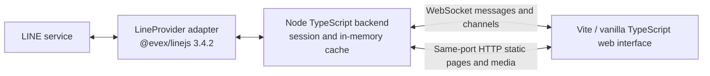
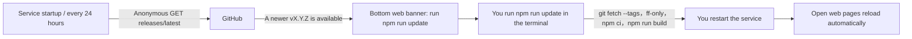

[繁體中文](README.md) ｜ **English** ｜ [日本語](README.ja.md)

# LINE.js

A local TypeScript LINE web client that connects to LINE using the pinned [@evex/linejs v3.4.2](https://github.com/evex-dev/linejs/tree/v3.4.2), synchronizes channels and messages over WebSocket, and serves the web interface over HTTP on the same port.

> Development status: QR login/logout, session reuse, channel lists (friends and chats tabs, profile pictures), live and historical messages, sending text/images/videos/stickers (including pasting images or videos and selecting stickers from owned packs), inline display of received images/GIFs/videos/voice messages, others' read receipts, sending read receipts and unread counts, OpenChat administrator badges, links in messages, system messages (such as 「XX 新增 OO 至群組」 (XX added OO to the group)), a full-screen disconnection overlay, a mobile hamburger menu, the bot API (`/api/ws`), the terminal interface (CLI), and version update notifications are available. Gate 1 acceptance using a secondary account to scan the QR code still awaits confirmation from 小語.

## Agreed purpose and scope

The complete goal includes QR login/logout, session reuse, lists of friends/groups/chat rooms/OpenChat, live messages and edit events, paginated history, sending text/images/stickers, and displaying images/GIFs/videos/voice messages/stickers. Files display placeholders only. Public deployment, multiple accounts, calls, and package publishing are out of scope; features not yet delivered are subject to their Gate status.

This project uses unofficial LINE APIs and may cause account restrictions or bans. **Verify with a secondary account first**; do not test directly with your main account.

**Quick navigation**: [Installation and startup](#installation-and-startup)｜[Management scripts](#management-scripts)｜[Configuration](#configuration)｜[Bot API](#bot-apiapiws)｜[Terminal interface (CLI)](#terminal-interface-cli)｜[Version updates](#version-updates)｜[Security policy](SECURITY.md)

## Target system architecture (including later Gates)



The backend binds only to `127.0.0.1` by default (configurable in `config.yaml`; see “Configuration”), on port `3789` by default. The backend builds with `tsc` into `dist/`; the frontend builds with Vite into `dist/web/`. Messages are stored only in memory (up to 500 per channel, deduplicated by id, with edits overwriting existing messages), without a database. Stickers, profile pictures, and received media are cached by the backend in an LRU cache (200MB by default) and served over HTTP on the same port.

## Requirements

- Node.js **≥ 22** and npm.
- Network access to JSR, npm, and LINE.
- A secondary LINE account that can scan a QR code and confirm a PIN.
- Both `@evex/linejs` and `@evex/linejs-types` are pinned to **3.4.2** (JSR); all other direct dependencies must also have pinned versions.

Upstream 3.4.2's Thrift dependency contains a high-severity vulnerability. This project pins the patched `thrift@0.23.0` through `overrides`, without changing the LINE package versions. Patch reference: [CVE-2026-41636](https://github.com/advisories/GHSA-r67j-r569-jrwp). Compatibility of login reuse, channel lists, and live messages has been verified with a real LINE account.

## Installation and startup

```sh
git clone https://github.com/JS-PACKAGE/LINE.js.git
cd LINE.js
npm install
npm run build
npm start
```

You can also use the root-level [management scripts](#management-scripts) to handle everything: `./linejs.sh start` (Windows: `.\linejs.ps1 start`) automatically installs missing dependencies or builds missing output before starting.

Open `http://127.0.0.1:3789`. If `session.json` can be reused, you enter the chat interface directly; otherwise, click 「產生登入 QR code」 (Generate login QR code), scan with a secondary account, and confirm the displayed PIN. The QR URL and PIN are sent only once over WebSocket to the connection that clicked the button; they are not logged or written to files, and refreshing does not replay them. Failures do not trigger automatic retries; click the button again. The left side has 「聊天」 (Chats) and 「好友」 (Friends) tabs, including profile pictures and unread counts. Messages appear on the right: consecutive messages from the same person share a profile picture and name (full names do not wrap; OpenChat administrators have a crown badge and co-administrators a shield badge), timestamps appear after messages in 24-hour format, and scrolling upward loads older history. Your own messages display 「已讀」 (Seen) above the timestamp in 1:1 chats, or 「已讀 N」 (Seen by N) in groups and chat rooms; OpenChat has no read receipts. Opening a chat with unread messages shows an unread separator. You can send text (Enter to send, Shift+Enter for a new line), images (click 「圖片」 (Images) to select a file, or **paste/drag** an image into the input field, then send after previewing; PNG/JPEG/GIF only), and stickers (the 「貼圖」 (Stickers) panel lists packs owned by this account; click a sticker to send it, or send manually by ID). Received images/GIFs display directly (click to enlarge), videos load only when you press play, and voice messages can be played directly. Locations, contacts, files and rich (flex) cards are shown as small cards with the text LINE attaches (place name, address and an 「在地圖上開啟」 (Open in map) link; contact name; file name and size; the card's alternative text); file contents are not downloadable. Calls and other types show type placeholders only. **Sending read receipts**: when the chat is open and the page is visible, the client reports to LINE that messages up to the latest one have been read (the other person sees 「已讀」 (Seen)); disable this with `chat.sendReadReceipts: false`. Clicking 「登出」 (Log out) at the top right opens a confirmation dialog; confirming revokes the LINE-side login and clears `session.json` and the cache.

**Other web behavior**:
- **Links**: `http://` and `https://` URLs in message text become clickable links that open in a new tab (with `rel="noopener noreferrer"`, so the destination cannot access this page and receives no Referer). Trailing punctuation and extra closing parentheses are excluded from URLs; other protocols (such as `ftp://`) are not linked. The server does not fetch any URLs, and there are no link preview cards (deliberately: CSP and CORS prevent browser-side access, while server-side fetching risks SSRF and IP disclosure).
- **System messages**: LINE membership events (`CHATEVENT`, currently supporting `C_MI`) display as small, centered gray pills, such as 「XX 新增 OO 至群組」 (XX added OO to the group). Other event types whose meanings have not been confirmed always display the placeholder 「［系統訊息］」 ([System message]); their content is not guessed.
- **Take-backs**: when someone (or you, on another device) takes a message back, it becomes 「XX 已收回訊息」 (XX took back a message; your own read 「你已收回訊息」), replies quoting it show 「［已收回的訊息］」 ([Message taken back]), and its picture/video/voice is no longer served. If the take-back notice arrives before the message itself, only the placeholder is shown. Only message ids this service has already received are affected; nothing is guessed from the notice. Your own messages can be taken back with 「收回」 (Take back) in the context menu (after a confirmation; LINE only allows this for a limited time after sending, and a refusal shows a generic error). In OpenChat, the service recognizes your member id there only after you have sent a message from this page.
- **@ mentions**: names tagged in received messages are shown in the accent color; a tag of you, or @All, also gets a yellow background. Ranges come from LINE's mention data; anything that does not fit (beyond the text, overlapping) is not highlighted. In OpenChat your member id differs from your account, so tags of you there only get the ordinary accent color.
- **Desktop notifications**: clicking 「通知：關」 (Notifications: off) at the top left asks the browser for permission and turns them on (the choice is kept in the browser's localStorage; click again to turn off). Only new messages from others are notified, and only while the page is not in the foreground; each chat shows at most one notification, replaced by its newest message; clicking it returns to the page with that chat open, and it closes once the chat is read. The notification content (sender and message preview) appears in the operating system's notification center. A secure context is required (`127.0.0.1`/`localhost` or HTTPS); on other http addresses the button is hidden.
- **Disconnection overlay**: if the WebSocket connection to the local service is interrupted, 「與伺服器斷線」 (Disconnected from the server) covers the entire screen. It disappears automatically on reconnection, and messages are resynchronized (using the full snapshot sent on connection: one frame per chat, merged and redrawn once by the page).
- **Mobile layout**: at window widths ≤ 720px, the chat and friends lists move into a left drawer, opened with the 「☰」 hamburger button at the top left of the conversation header (click the backdrop or press Esc to close; selecting a chat closes it automatically). The drawer opens by default if no chat is selected. The desktop layout is unchanged.

The app can be installed as a PWA (the browser's 「安裝」 (Install) action; favicon and manifest included). The service worker caches only public static files, never `/media/*` or `/ws`; pages always use a network-first strategy. The web interface disables the browser's native context menu except in input fields, replacing it with a message menu (right-clicking a chat in the list shows and copies its channel ID); this is a convenience, not a security mechanism. Unread counts in the chat list come from LINE and are cleared after opening a chat and sending a read receipt.

`session.json` contains credentials and E2EE key material. It must be saved with permissions `600` and must not be shared or committed. `config.yaml` contains personal configuration and is excluded from version control. `api-token.json` (the bot Token's SHA-256 and creation time, permissions `600`) and `linejs.pid` (the running service's PID, used by `stop`/`restart`) are also excluded from version control.

SessionStorage in `src/line/session.ts` follows the linejs FileStorage contract, but saves data through serialized writes, temporary files with permissions `600`, and atomic replacement to prevent concurrent writes from losing tokens/keys. Existing files have their permissions tightened. Corrupt JSON and symlinks are refused without overwriting the original data. A write failure causes subsequent `flush()` calls to fail rather than falsely claiming the session was saved.

### Gate 1 acceptance

1. Start the process, scan the QR code in the web interface with a **secondary LINE account**, and complete PIN confirmation. The web interface should enter the chat interface automatically.
2. Send a message from LINE on your phone. Within 60 seconds, the terminal should show `LINE 訊息收到：id=… type=… kind=…` (LINE message received: id=… type=… kind=…), and the chat should display the message and unread count in real time. Only identifiers are logged, not message contents.
3. Stop the service and run `npm start` again. Confirm that the session is reused directly without rescanning, and that `session.json` still has permissions `600`.

## Configuration

`config.example.yaml` includes item-by-item comments in Traditional Chinese. On first startup, if `config.yaml` is missing, it is created automatically without overwriting an existing file; personal configuration takes precedence when present. Fields are grouped into `server`, `line`, `history`, `cache`, `chat`, `update`, `api`, and `limits` (the `chat`, `update`, and `api` sections, plus `limits.downloadMaxBytes` and `limits.uploadVideoMaxBytes`, may be omitted; older configuration files still work; `api` is disabled by default).

- Listening host: defaults to the recommended `127.0.0.1`. `config.yaml` is authoritative; other hostnames, IPv4, or IPv6 addresses are allowed, and the program no longer enforces loopback. The web interface has no username/password, so anyone who can reach that address can operate the logged-in LINE account. A warning is printed on startup for non-local addresses. **The `Host` header is not restricted**: regardless of the listening address, connections using any IP or domain name are accepted (for example, reverse proxies, LAN names, or tunnel services). `Origin`, cookie, and Token checks remain unchanged, and requests with `Sec-Fetch-Site: cross-site` are still rejected. The tradeoff is that DNS rebinding is no longer prevented (when an attacker's domain resolves to a local address, that page is same-origin with the service).
- port: defaults to `3789` and is configurable; host and port are read from `config.yaml` and must not be hardcoded.
- LINE device: defaults to `ANDROIDSECONDARY`.
- History page size: 50 by default, at most 100 per request.
- Per-channel message cache: up to 500 messages; media LRU cache: 200MB by default.
- WS frame: at most 256KB; text: at most 8000 characters.
- Sending: at most 5 sends per second per WS connection. Media uploads: at most 10MB per image (PNG/JPEG/GIF), at most 50MB per video (MP4/MOV; configurable with `limits.uploadVideoMaxBytes`, capped at 200MB; the entire video is temporarily held in memory), and at most 5 uploads per minute per connection.
- Received media: at most 50MB each (`limits.downloadMaxBytes`); larger items show only a type label.
- Bot API: disabled by default; `api.enabled`, `api.chats` (required, at least one chat room id), and `api.sendsPerMinute` (20 by default, ≤120). See [Bot API](#bot-apiapiws) for details.

## Protocol

Same-port `ws://<host>:<port>/ws` (default `ws://127.0.0.1:3789/ws`; the web interface automatically uses `wss://` behind a TLS reverse proxy or with a custom domain), with JSON frames. The per-frame limit is set by `limits.frameMaxBytes` (≤256KB). An upgrade requires all of the following: path `/ws`, the host in `Origin` (`http` or `https`) matching `Host`, and the HttpOnly/SameSite=Strict browser cookie issued by the homepage; otherwise it returns 403. Reverse proxies must forward WebSocket upgrade headers and preserve the original `Host` (nginx: `proxy_set_header Host $host;`, `proxy_set_header Upgrade $http_upgrade;`, `proxy_set_header Connection "upgrade";`). See [section 4 of PLAN.md](PLAN.md) for complete payloads (PLAN.md is in Chinese).

Available:

| Direction | type | Purpose |
|---|---|---|
| Server → Client | `hello` | Protocol version 2 and server version; on receipt, the frontend clears its local cache and waits for a full snapshot |
| Server → Client | `auth:state` | `restoring`／`idle`／`authenticating`／`ready`／`error` |
| Server → Client | `auth:qr` / `auth:pin` | One-time delivery, only to the connection that initiated `auth:start` |
| Server → Client | `auth:ready` | Login completion and account data; a snapshot (`channels`, plus in-memory messages as one `messages` frame per chat) is sent on connection |
| Server → Client | `channels` | Channel snapshot; resent when channels are added or refreshed |
| Server → Client | `messages` | Connect-time message snapshot: `{ chatId, messages }`, one frame per chat (old messages, never counted as unread) |
| Server → Client | `message` / `message:edit` | Live messages and overwrites of existing messages |
| Server → Client | `message:unsend` | `{ chatId, messageId }`: the message was taken back; show a placeholder (`Message.unsent: true`, no content) |
| Server → Client | `status` / `error` | LINE listener status and generic errors |
| Server → Client | `history` / `sent` | One history page (including `cursor`)/send confirmation |
| Server → Client | `read` | Others' read positions (snapshot when opening a chat and live increments) |
| Client → Server | `auth:start` / `auth:logout` | Start QR login/log out |
| Client → Server | `history:fetch` / `message:send` | Load one history page/send text, images (first `POST /media/upload`), or stickers |
| Client → Server | `stickers:list` → `stickers` | Retrieve sticker packs owned by this account and sticker ids |
| Client → Server | `message:unsend` | `{ requestId, chatId, messageId }`: take back one of your own messages (pages only; the server accepts only this account's messages and shares the `message:send` rate limit); success is broadcast as `message:unsend` |
| Client → Server | `chat:read` | Report messages read through a specific message (no response; only messages already displayed by the server, once per position) |
| Client → Server | `message:send` (`mentions`／`replyTo`) | Text may include @ mentions and a reply target (message context menu: 「回覆」 (Reply), 「@ 提及」 (@ Mention), 「複製文字」 (Copy text); images also offer 「複製圖片」 (Copy image) and 「下載圖片」 (Download image), videos 「下載影片」 (Download video)) |
| Client → Server | `channels:refresh` / `ping` | Reload channels/keep the connection alive |
| Server → Client | `api:state` / `api:token` | Bot API state (web interface only)/newly generated Token (sent only once to the requesting connection) |
| Client → Server | `api:token:create` / `api:token:revoke` | Generate or revoke a bot Token (web connections only, not bots) |

HTTP: both `GET /media/:mediaId` (stickers, sticker pack icons, profile pictures and originals, received images/videos/voice messages; supports Range) and `POST /media/upload` (image/video uploads) require a browser cookie and same-origin access. WS does not carry media bytes.

### Bot API（`/api/ws`）

Lets your own programs (bots) send and receive messages. **Disabled by default**; enabling it takes three steps:

1. Add the following to `config.yaml` and **restart the service** (see `config.example.yaml` for the template):
   ```yaml
   api:
     enabled: true
     chats:                      # Chat room ids accessible to bots, at least one; unlisted chats are treated as nonexistent for bots
       - c0123456789abcdef0123456789abcdef
     sendsPerMinute: 20          # Maximum total sends per minute across all bots (1～120, optional, default 20)
   ```
   If `enabled: true` has no valid `chats`, service startup fails outright (to avoid treating “an empty list” as “all chats”).
2. Generate a Token with `npm run cli -- token` (see [CLI `token`](#token-regenerate-or-revoke-the-bot-api-token)). The Token is shown **once**; the server stores only its SHA-256 (`api-token.json`, permissions 600, excluded from version control). It cannot be viewed again; generate a new one if you lose it. The web page has no Token management UI; the CLI is the only way.
3. Connect your bot to `ws://<host>:<port>/api/ws` (default `ws://127.0.0.1:3789/api/ws`) with the header `Authorization: Bearer <Token>`.

**Connection rules**
- An upgrade requires all of the following: `api.enabled`, **no `Origin` header** (browser WebSockets always include it, so no web page can use this endpoint, even if a Token leaks to a page), and a valid Token (compared in constant time). Every failure returns 403 without revealing which check failed. At most 4 connections are allowed simultaneously; additional connections receive 429.
- Replacing or revoking the Token **immediately** disconnects all bots (close code 1008); the old Token is no longer valid.

**Allowed operations (frame allowlist)**

| Direction | type | Description |
|---|---|---|
| Bot → Service | `message:send` | `{ requestId, chatId, text, mentions?, replyTo? }`: **text only**; `mediaId`／`sticker` returns `INVALID_REQUEST`. Success returns `sent { requestId, messageId }` |
| Bot → Service | `history:fetch` | `{ requestId, chatId, limit?, before? }`: the same pagination as the web interface, without a read-receipt snapshot |
| Bot → Service | `ping` | Keepalive |
| Service → Bot | `hello`, `auth:state`, `status` | Sent on connection; sending/receiving is unavailable until `auth:state` is `ready` (LINE is logged in) |
| Service → Bot | `auth:ready` | Includes your own `profile.userId` to skip your own messages (messages sent from your phone also use this id) |
| Service → Bot | `channels` | Only chat rooms in `api.chats`; resent on changes |
| Service → Bot | `message`, `message:edit`, `message:unsend` | Only **live** messages, edits and take-backs from chat rooms in `api.chats`, including your own |
| Service → Bot | `sent`, `history`, `error` | Responses to corresponding requests; errors contain only generic codes (`UNKNOWN_CHAT`, `INVALID_REQUEST`, `RATE_LIMITED`, `SEND_FAILED`…) |

Everything else returns `UNKNOWN_TYPE`: no login/logout, `chat:read` (sending read receipts), `message:unsend` (taking back), `channels:refresh`, sticker lists, or Token management. **Old messages are not replayed** (bots start from “now” and do not respond to history again; use `history:fetch` for history). No `read`, `update:available`, or `api:state` is provided. Image/video and other media bytes are also inaccessible (bots see only the message's `contentType`).

**Rate limits and risks**
- Each connection is limited by `limits.sendsPerSecond` (≤5), and all bots together may not exceed `api.sendsPerMinute`; exceeding either returns `RATE_LIMITED`.
- Bots speak through **your personal account**. Frequent or mechanical sending may trigger LINE's risk controls. Set conservative limits and use a secondary account first.

```js
import WebSocket from "ws";
const ws = new WebSocket("ws://127.0.0.1:3789/api/ws", { headers: { Authorization: `Bearer ${process.env.LINEJS_TOKEN}` } });
let me;
ws.on("message", (data) => {
  const frame = JSON.parse(data);
  if (frame.type === "auth:ready") me = frame.profile.userId;
  if (frame.type === "message" && frame.message.senderId !== me && frame.message.text === "ping") {
    ws.send(JSON.stringify({ type: "message:send", requestId: "r1", chatId: frame.message.channelId, text: "pong" }));
  }
});
```

## Terminal interface (CLI)

Log in, log out, and replace Tokens without opening the web interface. The CLI **does not directly access `session.json`**; it connects to the **running** service, first using `GET /` to obtain a browser cookie, then the same WebSocket (`/ws`) and workflow as the web interface. There is therefore only one set of security checks and state, and the web interface and CLI see the same login state. The service address comes from `server` in `config.yaml` (a `0.0.0.0` binding is accessed through loopback instead).

**Prerequisites**: run `npm start` first, and have already run `npm run build` (the CLI runs the built `dist/` output).

```sh
npm run cli -- login     # 登入
npm run cli -- logout    # 登出
npm run cli -- token     # 重新產生機器人 API Token（加 --revoke 則撤銷）  (regenerate the bot API Token; add --revoke to revoke it)
npm run cli              # 不帶指令：顯示用法
```

> Do not omit the `--` after `npm run cli`; otherwise npm consumes the following arguments.

**Options**: `--yes` (or `-y`) skips confirmation. Environments without a terminal (scripts, scheduled jobs) cannot prompt and **must** use `--yes`; otherwise execution is refused. `--revoke` is only valid with `token`; any other combination is a usage error (exit code 2).

### `login`: log in and display a QR code in the terminal

1. Connect to the service; if it is still restoring the session, wait for completion.
2. Already logged in → print 「已經登入。」 (Already logged in.) and 「已登入：<名稱>」 (Logged in: <name>), then exit without doing anything.
3. Otherwise, start QR login, wait for LINE to generate the QR code, and draw it with block characters in the terminal. Scan with **LINE on a secondary account**.
4. After scanning, the phone asks for a PIN, printed below the QR code.
5. After LINE confirms, print 「已登入：<名稱>」 (Logged in: <name>) and exit; an open web interface also enters the chat interface.

- The QR code and PIN **appear only in the terminal running the command**: they are not written to files, logged, or broadcast to the web interface or other connections (the original QR URL itself is not printed).
- Waits at most 3 minutes; run the command again after failure or timeout (no automatic retry loop).
- If the web interface or another terminal is already logging in, it reports 「目前無法開始登入：已有登入程序在進行」 (Cannot start login now: a login process is already in progress). Complete login there.

### `logout`: log out

1. Not logged in → print 「目前沒有登入的 LINE 帳號。」 (No LINE account is currently logged in.) and do nothing.
2. Logged in → ask for confirmation: 「登出會清除本機登入資料與快取，並登出此裝置；下次需要重新掃描 QR code。確定登出？(y/N)」 (Logging out clears local login data and cache and logs out this device; next time you must scan the QR code again. Log out? (y/N)).
3. After confirmation, revoke the LINE-side login, clear `session.json` and the in-memory cache, and print 「已登出。」 (Logged out.). If LINE-side logout cannot be confirmed, an additional reminder asks you to remove this device manually under 「登入中的裝置」 (Logged-in devices) in LINE on your phone.

### `token`: regenerate or revoke the bot API Token

- Enable `api` in `config.yaml` first (see [Bot API](#bot-apiapiws)); otherwise it returns 「機器人 API 未啟用」 (Bot API is not enabled).
- If a Token exists, first confirm: 「目前的 Token 會立即失效，使用它的機器人會被中斷連線。確定重新產生？」 (The current Token will immediately become invalid, and bots using it will be disconnected. Regenerate?).
- The new Token is **printed alone to standard output**; all other messages (instructions, warnings) go to standard error, so it can be assigned directly to a variable. The Token is shown only once:

  ```sh
  LINEJS_TOKEN=$(npm run -s cli -- token --yes)   # -s 讓 npm 不印自己的標頭，輸出才乾淨
  ```
- `token --revoke`: revokes the current Token without issuing a new one. It first confirms (「撤銷後機器人會被中斷連線，且在重新產生前無法再連線。確定撤銷？」: Revoking disconnects bots, and they cannot reconnect until a new Token is generated. Revoke?), then immediately disconnects all bots and deletes `api-token.json`. With no Token it prints 「目前沒有 Token，不需撤銷。」 (There is no Token; nothing to revoke.) and exits 0.
- Only ordinary `/ws` connections that hold the browser cookie (that is, the local CLI) can generate or revoke Tokens; bot connections cannot replace their own Token. The Token is sent only to the requesting connection.

### Exit codes and common messages

| Exit code | Meaning |
|---|---|
| 0 | Success; or confirmation canceled, not currently logged in (`logout`), already logged in (`login`); or usage displayed without a command |
| 1 | Failure: cannot connect to the service, rejected by the service, login failed/timed out, API disabled, service connection interrupted, etc. |
| 2 | Invalid command or option (usage included) |

| Message | Meaning, cause, and action |
|---|---|
| 連不上服務（http://…）。請先執行 npm start。 | Cannot connect to the service (http://…). Run npm start first. The service is not running, or `server.host`／`port` in `config.yaml` differs from the service's actual settings. |
| 服務拒絕了連線，請確認 config.yaml 的 server.host 與 server.port。 | The service rejected the connection; check server.host and server.port in config.yaml. The endpoint is not this service (for example, another program occupies the port), or the service rejected the request. |
| 服務與 CLI 的通訊協定版本不同… | The service and CLI have different protocol versions… The program was updated without rebuilding or restarting: run `npm run build` and restart the service. |
| 非互動環境無法確認；若確定要執行，請加上 --yes。 | Confirmation is unavailable in a non-interactive environment; add --yes if you intend to proceed. Confirmation is required but no terminal is available. |
| 機器人 API 未啟用… | Bot API is not enabled… Configure `api.enabled` and `api.chats` as above, restart, and retry. |
| 登入失敗，請重新執行 login。 | Login failed; run login again. The QR code expired, the PIN was incorrect, or LINE rejected login; rerun the command. |

## Management scripts

The root-level `linejs.sh` and `linejs.ps1` provide equivalent functionality, grouping common operations into the same commands: `linejs.sh` (macOS/Linux, POSIX `sh`) and `linejs.ps1` (Windows PowerShell 5.1/PowerShell 7). You can invoke them from any directory; they first switch to the project root.

```sh
./linejs.sh start            # 啟動服務（前景執行，Ctrl+C 停止）
./linejs.sh stop             # 停止正在執行的服務
./linejs.sh restart          # 停止後重新啟動（沒在執行時等同 start）
./linejs.sh update           # 更新到最新版（可加 --check、--verify）
./linejs.sh login            # 登入：在終端機顯示 QR code
./linejs.sh logout           # 登出並清除本機登入資料
./linejs.sh token            # 重設機器人 API Token（新 Token 只顯示一次）
./linejs.sh help             # 顯示用法
```

```powershell
.\linejs.ps1 start           # 其餘指令相同：stop／restart／update／login／logout／token／help
# 若系統禁止執行腳本：powershell -ExecutionPolicy Bypass -File .\linejs.ps1 start
```

| Command | Actual execution | Description |
|---|---|---|
| `start` | `node dist/main.js` | Accepts no arguments. If `node_modules` does not match `package-lock.json` (missing packages or wrong versions, e.g. after an interrupted install or a lockfile change), runs `npm ci --include=dev` and then `npm run build`; if build output (`dist/main.js`, `dist/web/index.html`) is missing, or the sources (`src/`, `web/`, `package.json`, `package-lock.json`, `tsconfig.json`) are newer than it (e.g. after a plain `git pull` of code changes), runs `npm run build`. When both are up to date, starts directly without either step. Runs in the foreground; Ctrl+C stops it. Refuses to start if the service is already running and suggests `restart`. |
| `stop` | `node scripts/service.mjs stop` | Accepts no arguments. Finds the service through `linejs.pid` and sends a termination signal (`SIGTERM`; the service closes its LINE connection and finishes writing `session.json` before exiting), waiting at most 20 seconds. Reports success even if it is not running. |
| `restart` | `stop` then `start` | Accepts no arguments. Stops the running service first (skips if not running), then starts in the foreground, taking over this terminal; the service in the original terminal exits. |
| `update` | `node scripts/update.mjs …` | Equivalent to `npm run update`, forwarding options unchanged: `--check` only checks, and `--verify` requires a tag signature. See [Version updates](#version-updates) for the workflow and abort conditions; run `start` again after updating. |
| `login`／`logout`／`token` | `node scripts/cli.mjs <指令> …` | Equivalent to `npm run cli -- <指令>` (<command>), forwarding options such as `--yes` unchanged. **The service must already be running** (run `start` in another terminal). See [Terminal interface (CLI)](#terminal-interface-cli) for details and exit codes. If dependencies or the build are out of date, it does not reinstall or rebuild underneath the running service; it asks you to `restart` first. |

- The scripts first check for Node.js ≥ 22 and npm, aborting with a clear message if requirements are not met; exit codes are passed through unchanged (unknown commands return 2).
- **How `stop`/`restart` find the service**: on startup, the service writes its PID to `linejs.pid` in the project root (permissions 600, excluded from version control), removing it on normal exit. The scripts terminate only a process “pointed to by `linejs.pid` **whose command line is actually this project's `dist/main.js`**.” If the PID file is stale (a crashed service left it behind, or another program reused the PID), only the file is cleared; that process is not touched.
- This mechanism applies from the version that introduced `linejs.pid`: after updating for the first time, stop the old service manually (Ctrl+C). Only services subsequently launched with `start` can be found by `stop`/`restart`. Windows has no signal mechanism, so `stop` terminates the process directly (`session.json` writes are atomic and never leave a partially written file).
- If `stop` cannot observe the service exiting within 20 seconds, it reports failure with the PID. Inspect it and terminate it manually; the script does not force-kill it.
- Like `npm run cli -- token`, `token` prints only the new Token to standard output, so you can capture it directly: `LINEJS_TOKEN=$(./linejs.sh token --yes)` (PowerShell: `$env:LINEJS_TOKEN = .\linejs.ps1 token --yes`). The scripts call `node` directly rather than through `npm run`, so npm headers do not contaminate the output.
- The scripts are only shortcuts for the commands above, with no additional privileges; handling of `session.json`, `config.yaml`, and `api-token.json` is unchanged.

## Build and verification

The following commands are available. `npm test` builds first, then uses an isolated fake provider to test configuration, sessions, login/logout, message caching, history and send validation/rate limits, media routes (including Range), read receipts, and WS security:

```sh
npm run typecheck
npm run build
npm test
npm audit
```

Tests use `node --test` and a Mock Provider; mocks do not replace real LINE acceptance. Gate 1 requires scanning with a secondary account and receiving a real message within 60 seconds; Gates 2–4 additionally verify web synchronization, history, sending, and media. See [PLAN.md](PLAN.md) for all Gates and acceptance criteria.

Verified: typecheck, build, 123 tests, and no high-severity findings from `npm audit`. With a real LINE account: session reuse, channel lists, live messages from friends/groups/OpenChat, talk history pagination (deduplicated, ordered, and scrollable to the end), OpenChat history pagination, profile pictures and non-friend name lookup, OpenChat image download/display, owned sticker pack lists (7 packs, including Traditional Chinese names and icons), administrator/co-administrator role detection in OpenChat messages, and rescanning to log in through the web interface (the service log shows the QR login flow and a switch to another account). In the browser with a fake provider: upward pagination, input/sending workflow, pasted image preview and sending (including sending text afterward), rejection of pasted videos, the owned sticker panel (pagination and click-to-send), image uploads, profile pictures and fallback letters, read/unread indicators, read-receipt triggers, badges and full nicknames without wrapping, timestamps after messages and 24-hour format (00:05, not 24:05), image enlargement, video (Range) and voice playback, confirmation dialogs, scrolling to the bottom after sending (including OpenChat cases where the replier's id differs from your own) and staying at the bottom when receiving stickers, the new-version banner (dismissal remembered), the refresh prompt when service/page versions differ, and automatic reload of old tabs after service restart. **Bot API, CLI, and other additions**: automated tests with a fake provider cover authentication (missing Token/incorrect Token/`Origin` present/incorrect `Host`), frame allowlisting, chat scope, no replay of old messages, global send limits, the maximum of 4 connections, immediate disconnection on Token replacement/revocation, hash-only Token storage and file permissions, and CLI `login` (QR and PIN only in the terminal)/`logout`/`token`/`token --revoke` (revocation, no-op when there is no Token, and `--revoke` with any other command treated as a usage error). Against the real service, the CLI was only exercised with side-effect-free `login` (reporting state when already logged in) and the `token` error when the API is disabled. Parsing and names for 「XX 新增 OO 至群組」 (XX added OO to the group) were verified using historical messages from a real account. **Not yet verified** (requires side effects on real contacts or corresponding real messages): actual LINE sending and live receiving through the bot API, CLI `logout` and the real QR scanning login flow, the live system-message event path (only history was verified), actual use with a non-local binding, real text/sticker/image sending, real read receipts (the effect of `sendChatChecked`/OpenChat `markAsRead` on LINE), server confirmation of LINE-side logout, receiving/decrypting E2EE images, 1:1 read-event field formats (known mismatched shapes are ignored), real GIF/video sources, and backoff reconnection after listen interruptions. The full `npm run update` workflow was verified only with temporary git repositories and a fake `npm`, not against a real newer version (the repository's current latest Release is v0.9.0; update notification queries against the real GitHub Release API have been tested).

## Version updates

Versions follow `package.json` and semver, published as GitHub Releases/tags `vX.Y.Z` (pushing tags and publishing Releases require explicit maintainer authorization). Updating is deliberately split into **automatic notifications** and **manual updates**: **LINE.js never downloads or executes new code on its own**.



### 1. Notifications (automatic, informational only)

- **Timing**: once at service startup, then every 24 hours.
- **Request**: anonymous `GET https://api.github.com/repos/JS-PACKAGE/LINE.js/releases/latest`. No credentials, cookies, LINE data, or identifying information is sent (except the IP inherently disclosed by HTTPS and the fixed `User-Agent: LINE.js-update-check`).
- **Strict parsing**: only `X.Y.Z`/`vX.Y.Z` are recognized; pre-releases and drafts are ignored. Release links are displayed only if they point to this project's `/releases/`. Release descriptions are untrusted and are not forwarded. Redirects are not followed, and response size is bounded. No Releases in the repository (404) means “no new version.”
- **Display**: a bottom banner says 「有新版本 vX.Y.Z 可用（目前 vA.B.C）。請在終端機執行 `npm run update`，完成後重新啟動服務。」 (New version vX.Y.Z is available (current: vA.B.C). Run `npm run update` in the terminal, then restart the service.), with a 「版本說明」 (Release notes) link. Click ✕ to dismiss; the browser remembers that version in `localStorage` and does not prompt again until a newer version appears.
- **Failures**: network or GitHub failures retry with backoff of 5, 10, 20 minutes… up to 24 hours, rather than repeatedly hammering the service.
- **Disable**: set `update.check: false` in `config.yaml` to make no external update queries.

### 2. Updating (initiated by you)

```sh
npm run update                  # 更新到最新版，並重新安裝依賴、建置
npm run update -- --check       # 只檢查有沒有新版，不改動任何東西
npm run update -- --verify      # 更新前額外要求最新 tag 通過 git verify-tag（需維護者簽署該 tag）
```

`npm run update` performs these steps in order, aborting with an explanation if any step fails:

1. Confirm that this is a git repository with an `origin` remote and a recognizable version in `package.json`.
2. Confirm that **tracked files have no uncommitted changes** (untracked `config.yaml`, `session.json`, and `api-token.json` are unaffected and never touched).
3. Run `git fetch --tags origin` and find the newest of all `vX.Y.Z` tags.
4. Exit if none is newer than the current version (「已是最新版」 (Already up to date)); `--check` stops here.
5. With `--verify`, `git verify-tag` must pass.
6. The current commit must be an ancestor of the tag before advancing by **fast-forward** (only `merge --ff-only`; on a detached HEAD, use `checkout --detach` to that tag instead). If local commits are absent from the tag, abort; merge/rebase yourself before updating. **Your content is not overwritten**.
7. Run `npm ci --include=dev` (install pinned dependencies from the lockfile; the build needs devDependencies, so they are installed even with `NODE_ENV=production`).
8. Run `npm run build`.
9. Show 「已更新到 vX.Y.Z，請重新啟動服務」 (Updated to vX.Y.Z; restart the service).

To restart, press Ctrl+C in the terminal running `npm start`, then run `npm start` again. `session.json` is reused; no rescan is needed. If step 7 or 8 fails, the code has already switched to the new version; the message includes rollback commands (`git checkout <舊提交>` (<old commit>), then `npm ci --include=dev && npm run build`).

- **No one-click web update**: deliberate, to prevent a web-layer vulnerability from escalating into remote code execution.
- **Trust model**: updates trust the `origin` remote and GitHub's TLS. Tags are cryptographically verified only with `--verify` and a maintainer-signed tag. If you require stronger assurance, inspect the diff between the two tags before updating.
- For older versions without this feature (before v0.9.0), run `git pull` manually once first.

### 3. Page synchronization (automatic)

- Open tabs reload automatically after service restart (only after the old cookie becomes invalid, three consecutive rejections occur, and the service is reachable; at most once every 30 seconds to avoid reload loops when the service is actually down).
- If page and service versions differ, the prompt says 「本機服務已更新到 vX（此頁為 vY），請重新整理」 (The local service has updated to vX (this page is vY); please refresh). Incompatible protocol versions cause an immediate reload.

### 4. Publishing a new version (maintainers)

1. Update `version` in `package.json` and commit (for example, `release: vX.Y.Z`).
2. Create tag `vX.Y.Z` (signing recommended) and push; create the corresponding GitHub Release (not a pre-release).
3. Users' services see the notification at the next check (within 24 hours, or on restart).

The push, tag, and Release operations above are external actions and require explicit maintainer authorization.

See [SECURITY.md](SECURITY.md) (in English) for the security policy and reporting instructions.

## Development rules and licensing

See [AGENTS.md](AGENTS.md) (in Chinese) for engineering and security rules, and [PLAN.md](PLAN.md) for the full agreed plan. Commit in feature-based batches, excluding personal configuration and credentials; do not rewrite the existing `LICENSE` or `.nojekyll`.

This work, **LINE.js**, is licensed under **Apache-2.0**, as specified by the root [LICENSE](LICENSE). The consumed packages **@evex/linejs** and **@evex/linejs-types** are licensed under **MIT**, independently of this work; see the [upstream license](https://github.com/evex-dev/linejs/blob/v3.4.2/LICENSE). This repository is for cloning only; no npm/JSR package is published.
