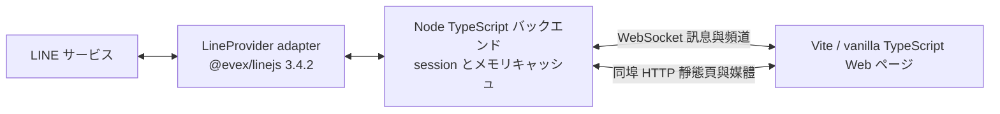
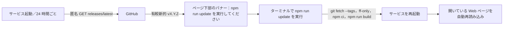

[繁體中文](README.md) ｜ [English](README.en.md) ｜ **日本語**

# LINE.js

ローカルで動作する TypeScript 製 LINE Web クライアントです。バージョンを固定した [@evex/linejs v3.4.2](https://github.com/evex-dev/linejs/tree/v3.4.2) で LINE に接続し、WebSocket でチャンネルとメッセージを同期し、同じポートの HTTP で Web ページを配信します。

> 開発状況：QR ログイン／ログアウト、session の再利用、チャンネル一覧（友だちとチャットのタブ、プロフィール画像）、リアルタイム・履歴メッセージ、テキスト／画像／動画／スタンプの送信（画像や動画の貼り付け、所有済みスタンプパックからの選択に対応）、受信した画像／GIF／動画／音声の埋め込み表示、相手の既読、既読通知と未読数、オープンチャットの管理者バッジ、メッセージ内のリンク、システムメッセージ（例：「XX 新增 OO 至群組」（XX が OO をグループに追加））、切断時の全画面オーバーレイ、モバイル版ハンバーガーメニュー、ボット API（`/api/ws`）、ターミナルインターフェース（CLI）、バージョン更新通知が利用できます。サブアカウントで QR コードを読み取る Gate 1 の受け入れ確認は、まだ小語による確認待ちです。

## 確定した用途と対象範囲

全体の目標には、QR コードによるログイン／ログアウト、session の再利用、友だち／グループ／チャットルーム／オープンチャットの一覧、リアルタイムメッセージと編集イベント、履歴のページ取得、テキスト／画像／スタンプの送信、画像／GIF／動画／音声／スタンプの表示が含まれます。ファイルはプレースホルダー表示のみです。公開環境へのデプロイ、複数アカウント、通話、パッケージ公開は提供しません。未提供の機能については Gate の状況を参照してください。

本作品は非公式の LINE API を使用しており、アカウントの制限や停止につながる可能性があります。**まずサブアカウントで検証してください**。メインアカウントで直接テストしないでください。

**クイックナビ**：[インストールと起動](#インストールと起動)｜[管理スクリプト](#管理スクリプト)｜[設定](#設定)｜[ボット API](#ボット-apiapiws)｜[ターミナルインターフェース（CLI）](#ターミナルインターフェースcli)｜[バージョン更新](#バージョン更新)｜[セキュリティポリシー](SECURITY.md)

## 目標システム構成（後続の Gate を含む）



バックエンドは既定で `127.0.0.1` のみにバインドします（`config.yaml` で変更できます。「設定」を参照）。既定のポートは `3789` です。バックエンドは `tsc` で `dist/` に、フロントエンドは Vite で `dist/web/` にビルドします。メッセージはメモリにのみ保存し（チャンネルごとに最大 500 件、同じ id は重複排除、編集は上書き）、データベースは使用しません。スタンプ、プロフィール画像、受信したメディアはバックエンドの LRU キャッシュ（既定 200MB）を経由し、同じポートの HTTP で配信します。

## 動作要件

- Node.js **≥ 22** と npm。
- JSR、npm、LINE に接続できるネットワーク。
- QR コードの読み取りと PIN の確認ができる LINE サブアカウント。
- `@evex/linejs` と `@evex/linejs-types` はともに **3.4.2**（JSR）に固定します。そのほかの直接依存もバージョンを固定する必要があります。

上流の 3.4.2 が依存する Thrift には high の脆弱性があるため、本プロジェクトでは `overrides` で修正版 `thrift@0.23.0` に固定し、LINE パッケージのバージョンは変更しません。修正の根拠：[CVE-2026-41636](https://github.com/advisories/GHSA-r67j-r569-jrwp)。実際の LINE アカウントで、ログインの再利用、チャンネル一覧、リアルタイムメッセージの互換性を確認済みです。

## インストールと起動

```sh
git clone https://github.com/JS-PACKAGE/LINE.js.git
cd LINE.js
npm install
npm run build
npm start
```

ルートディレクトリの[管理スクリプト](#管理スクリプト)でまとめて実行することもできます。`./linejs.sh start`（Windows：`.\linejs.ps1 start`）は、依存関係がない場合や未ビルドの場合、自動で準備してから起動します。

`http://127.0.0.1:3789` を開きます。再利用できる `session.json` があれば、そのままチャット画面に進みます。それ以外は「產生登入 QR code」（ログイン用 QR code を生成）をクリックし、サブアカウントで読み取って画面の PIN を確認します。QR URL と PIN は、ボタンを押した接続にだけ WebSocket で 1 回送信され、ログやファイルには保存されません。ページを再読み込みしても再送されません。失敗時に自動で繰り返すことはなく、もう一度ボタンを押す必要があります。左側には「聊天」（チャット）と「好友」（友だち）の 2 つのタブがあり、プロフィール画像と未読数も表示します。右側にはメッセージを表示します。同じ人の連続したメッセージは画像と名前をまとめて表示します（名前は省略・改行せず、オープンチャットの管理者には王冠、共同管理者には盾のバッジを表示）。時刻は 24 時間表記でメッセージの後ろに表示し、上にスクロールすると以前の履歴を読み込みます。自分が送信したメッセージは時刻の上に「已讀」（既読、1 対 1）または「已讀 N」（既読 N、グループとチャットルーム）を表示します。オープンチャットには既読通知はありません。未読のあるチャットを開くと未読の区切り線を表示します。テキスト（Enter で送信、Shift+Enter で改行）、画像（「圖片」（画像）でファイルを選ぶか、入力欄に画像を直接**貼り付け／ドラッグ**し、プレビュー後に送信。PNG／JPEG／GIF のみ）、スタンプ（「貼圖」（スタンプ）パネルにこのアカウントの所有済みスタンプパックを表示し、クリックすると即送信。ID による手動送信も可能）を送信できます。受信した画像／GIF は直接表示し（クリックで拡大）、動画は再生を押してから読み込み、音声は直接再生できます。位置情報、連絡先、ファイル、カードメッセージは、LINE が付ける文字情報を小さなカードで表示します（位置の名前、住所と「在地圖上開啟」（地図で開く）リンク、連絡先の名前、ファイル名とサイズ、カードの代替テキスト）。ファイル本体はダウンロードできません。通話などそのほかの種類は、種類のプレースホルダーのみ表示します。**既読通知**：チャット画面を開き、ページが表示されている間、最新メッセージまで既読として LINE に通知します（相手には「已讀」（既読）と表示されます）。`chat.sendReadReceipts: false` で無効にできます。右上の「登出」（ログアウト）を押すと確認ダイアログを表示し、確認後に LINE 側のログインを取り消して `session.json` とキャッシュを消去します。

**そのほかの Web ページの動作**：
- **リンク**：メッセージ内の `http://`、`https://` URL はクリック可能なリンクになり、新しいタブで開きます（`rel="noopener noreferrer"` を付けるため、相手のサイトはこのページを参照できず、Referer も受け取りません）。文末の句読点や余分な閉じ括弧は URL に含めず、ほかのプロトコル（`ftp://` など）はリンクに変換しません。サーバーは URL を取得せず、リンクプレビューカードもありません（意図的に実装していません。ブラウザー側では CSP と CORS により読み取れず、サーバーで代わりに取得すると SSRF と IP 漏えいのリスクがあります）。
- **システムメッセージ**：LINE のメンバー変更イベント（`CHATEVENT`、現在は `C_MI` に対応）は、中央寄せの小さな灰色のカプセルとして表示します。例：「XX 新增 OO 至群組」（XX が OO をグループに追加）。意味を確認できていないほかのイベントは、すべて「［系統訊息］」（システムメッセージ）のプレースホルダーとし、内容を推測しません。
- **送信取消**：相手（または別の端末のあなた）がメッセージの送信を取り消すと、そのメッセージは「XX 已收回訊息」（XX がメッセージの送信を取り消しました。自分の場合は「你已收回訊息」）に変わり、それを引用した返信は「［已收回的訊息］」（取り消されたメッセージ）と表示し、画像／動画／音声も提供しなくなります。取り消し通知がメッセージ本体より先に届いた場合も、プレースホルダーのみ表示します。対象はこのサービスが受信済みのメッセージ id のみで、通知の内容から推測はしません。
- **@ メンション**：受信したメッセージ内でメンションされた名前を強調色で表示し、あなた宛て、または @All の場合は黄色の背景も付けます。範囲は LINE が付けるメンション情報に従い、合わない部分（テキストの範囲外、重複）は強調しません。オープンチャットではメンバー id がアカウントと異なるため、あなた宛てでも通常の強調色のみです。
- **デスクトップ通知**：左上の「通知：關」（通知：オフ）をクリックすると、ブラウザーに通知の許可を求めて有効にします（設定はブラウザーの localStorage に保存され、もう一度クリックすると無効）。ページが前面にないときだけ、ほかの人からの新着メッセージを通知します。各チャットの通知は最大 1 件で、新しいメッセージに置き換わります。通知をクリックするとページに戻ってそのチャットを開き、既読になると通知は閉じます。通知の内容（送信者とメッセージの抜粋）は OS の通知センターに表示されます。安全なコンテキスト（`127.0.0.1`／`localhost` または HTTPS）が必要で、それ以外の http アドレスではボタンを表示しません。
- **切断オーバーレイ**：ローカルサービスとの WebSocket 接続が切れると、画面全体を「與伺服器斷線」（サーバーとの接続が切れました）で覆います。復旧すると自動で解除し、メッセージを再同期します（接続時の完全な snapshot を使用。チャットごとに 1 フレームで、ページはまとめて 1 回だけ再描画します）。
- **モバイル版**：ウィンドウ幅が ≤ 720px の場合、チャットと友だちの一覧を左側のドロワーに収納し、会話のタイトルバー左上の「☰」ハンバーガーボタンで開きます（背景のクリックまたは Esc で閉じ、チャットルームを選ぶと自動で閉じます）。まだチャットルームを選んでいない場合は、既定で開きます。デスクトップのレイアウトは変わりません。

PWA としてインストールできます（ブラウザーの「安裝」（インストール）。favicon と manifest を含みます）。Service worker は公開の静的ファイルのみキャッシュし、`/media/*` と `/ws` は扱いません。ページは常にネットワーク優先です。Web ページではブラウザー標準の右クリックメニューを無効にし（入力欄を除く）、メッセージメニューを表示します（チャットを右クリックするとチャンネル ID を表示・コピーできます）。これは操作の利便性のためであり、セキュリティ機構ではありません。チャット一覧の未読数は LINE 側の数値を使用し、チャットを開いて既読通知を送った後に消去します。

`session.json` には認証情報と E2EE key material が含まれるため、必ず権限 `600` で保存し、共有・コミットしてはいけません。`config.yaml` は個人設定であり、バージョン管理には含めません。`api-token.json`（ボット Token の SHA-256 と作成時刻、権限 `600`）と `linejs.pid`（実行中のサービスの PID。`stop`／`restart` で使用）もバージョン管理には含めません。

`src/line/session.ts` の SessionStorage は linejs FileStorage の契約を引き継ぎ、書き込みを直列化し、権限 `600` の一時ファイルとアトミックな置換で保存することで、並行書き込みによる token／key の消失を防ぎます。既存ファイルの権限も制限します。破損した JSON や symlink は読み込みを拒否し、元のデータを上書きしません。書き込みに失敗すると後続の `flush()` も失敗し、session を保存したと偽ることはありません。

### Gate 1 の受け入れ確認

1. プログラムを起動し、Web ページで**LINE サブアカウント**の QR コードを読み取り、PIN 確認を完了します。Web ページが自動でチャット画面に移行することを確認します。
2. スマートフォンの LINE でメッセージを 1 件送ります。60 秒以内にターミナルに `LINE 訊息收到：id=… type=… kind=…`（LINE メッセージ受信：id=… type=… kind=…）が表示され、Web ページの該当チャットルームにメッセージと未読数がリアルタイムで表示されることを確認します。識別情報のみ記録し、内容は dump しません。
3. 停止して再度 `npm start` を実行し、session が直接再利用され、QR コードの再読み取りが不要であることを確認します。`session.json` の権限が `600` のままであることも確認します。

## 設定

`config.example.yaml` には各項目の繁体字中国語の説明があります。初回起動時に `config.yaml` がなければ、既存ファイルを上書きしない方法で自動作成します。個人設定がある場合はそちらを優先します。項目は `server`、`line`、`history`、`cache`、`chat`、`update`、`api`、`limits` に分かれています（`chat`、`update`、`api` セクションと `limits.downloadMaxBytes`、`limits.uploadVideoMaxBytes` は省略でき、古い設定ファイルもそのまま動作します。`api` は既定で無効です）。

- 待ち受け host：既定値かつ推奨値は `127.0.0.1` です。`config.yaml` に従い、ほかのホスト名、IPv4、IPv6 に変更できます。プログラムはローカルループバックを強制しません。Web ページにはユーザー名・パスワードがないため、そのアドレスに接続できる人はログイン中の LINE アカウントを操作できます。ローカル以外のアドレスでは起動時に警告を出力します。**`Host` ヘッダーを制限しません**。どのアドレスで待ち受けても、任意の IP やドメイン名で接続できます（リバースプロキシ、LAN 内の名前、トンネルサービスなど）。`Origin`、cookie、Token の検査は変わらず、`Sec-Fetch-Site: cross-site` のリクエストも拒否します。その代わり、DNS rebinding は防ぎません（攻撃者のドメインがローカルアドレスに解決されると、その Web ページと同一オリジンになります）。
- port：既定は `3789` で、変更できます。host と port は `config.yaml` から読み取り、プログラムにハードコードしてはいけません。
- LINE デバイス：既定は `ANDROIDSECONDARY` です。
- 履歴件数：既定は 50、1 回あたり最大 100 です。
- チャンネルごとのメッセージキャッシュ：最大 500 件。メディア LRU：既定 200MB。
- WS frame：最大 256KB。テキスト：最大 8000 文字。
- 送信：WS 接続ごとに毎秒最大 5 回。メディアアップロード：画像は 1 ファイル最大 10MB（PNG／JPEG／GIF）、動画は 1 ファイル最大 50MB（MP4／MOV、`limits.uploadVideoMaxBytes` で変更可能、上限 200MB。動画全体をメモリに一時保存）、接続ごとに毎分最大 5 回。
- 受信メディア：1 件あたり最大 50MB（`limits.downloadMaxBytes`）。超過したものは種類のラベルのみ表示します。
- ボット API：既定で無効です。`api.enabled`、`api.chats`（必須、チャットルーム id が 1 個以上）、`api.sendsPerMinute`（既定 20、≤120）。詳細は[ボット API](#ボット-apiapiws)を参照してください。

## 通信プロトコル

同じポートの `ws://<host>:<port>/ws`（既定は `ws://127.0.0.1:3789/ws`。TLS リバースプロキシや独自ドメインを使う場合、Web ページは自動で `wss://` を使用）で JSON frames を使用します。1 frame の上限は `limits.frameMaxBytes`（≤256KB）で決まります。アップグレードには、パスが `/ws`、`Origin`（`http` または `https`）のホストが `Host` と一致、トップページで発行された HttpOnly／SameSite=Strict のブラウザー cookie を含む、という条件をすべて満たす必要があります。それ以外は 403 を返します。リバースプロキシは WebSocket アップグレードヘッダーを転送し、元の `Host` を保持する必要があります（nginx：`proxy_set_header Host $host;`、`proxy_set_header Upgrade $http_upgrade;`、`proxy_set_header Connection "upgrade";`）。完全なペイロードは [PLAN.md 第 4 節](PLAN.md)を参照してください（繁体字中国語）。

提供済み：

| 方向 | type | 用途 |
|---|---|---|
| Server → Client | `hello` | プロトコルバージョン 2 とサーバーバージョン。受信後、フロントエンドはローカルキャッシュを消去し、完全な snapshot を待ちます |
| Server → Client | `auth:state` | `restoring`／`idle`／`authenticating`／`ready`／`error` |
| Server → Client | `auth:qr` / `auth:pin` | 1 回限り。`auth:start` を開始した接続のみに送信します |
| Server → Client | `auth:ready` | ログイン完了とアカウント情報。接続時に snapshot（`channels` と、メモリ内のメッセージをチャットごとに 1 つの `messages` フレーム）を送信します |
| Server → Client | `channels` | チャンネルの snapshot。チャンネル追加時や更新後に再送します |
| Server → Client | `messages` | 接続時のメッセージ snapshot：`{ chatId, messages }`、チャットごとに 1 フレーム（過去のメッセージで、未読に数えません） |
| Server → Client | `message` / `message:edit` | リアルタイムメッセージと既存メッセージの上書き |
| Server → Client | `message:unsend` | `{ chatId, messageId }`：メッセージの送信が取り消されました。プレースホルダーを表示します（`Message.unsent: true`、内容なし） |
| Server → Client | `status` / `error` | LINE の受信待機状態と汎用エラー |
| Server → Client | `history` / `sent` | 履歴 1 ページ（`cursor` を含む）／送信確認 |
| Server → Client | `read` | 相手の既読位置（チャットを開いた時の snapshot とリアルタイムの差分） |
| Client → Server | `auth:start` / `auth:logout` | QR ログインの開始／ログアウト |
| Client → Server | `history:fetch` / `message:send` | 履歴 1 ページの取得／テキスト、画像（先に `POST /media/upload`）、スタンプの送信 |
| Client → Server | `stickers:list` → `stickers` | このアカウントの所有済みスタンプパックとスタンプ id の取得 |
| Client → Server | `chat:read` | 指定メッセージまでの既読通知（応答なし。サーバーが表示済みのメッセージに限り、各位置につき 1 回のみ送信） |
| Client → Server | `message:send`（`mentions`／`replyTo`） | テキスト送信に @ メンションと返信先を添付可能（右クリックメニュー：「回覆」（返信）、「@ 提及」（@ メンション）、「複製文字」（テキストをコピー）；画像には「複製圖片」（画像をコピー）と「下載圖片」（画像をダウンロード）、動画には「下載影片」（動画をダウンロード）も表示） |
| Client → Server | `channels:refresh` / `ping` | チャンネルの再取得／接続維持 |
| Server → Client | `api:state` / `api:token` | ボット API の状態（Web ページのみ）／新しく生成した Token（要求元の接続のみに 1 回限り送信） |
| Client → Server | `api:token:create` / `api:token:revoke` | ボット Token の生成・取り消し（Web 接続のみ。ボットは利用不可） |

HTTP：`GET /media/:mediaId`（スタンプ、スタンプパックのアイコン、プロフィール画像と元画像、受信した画像／動画／音声。Range 対応）と `POST /media/upload`（画像／動画のアップロード）は、どちらもブラウザー cookie と同一オリジンが必要です。WS ではメディアのバイト列を送信しません。

### ボット API（`/api/ws`）

自分のプログラム（ボット）でメッセージを送受信できます。**既定では無効**で、有効化には次の 3 手順が必要です。

1. `config.yaml` に以下を追加し、**サービスを再起動**します（テンプレートは `config.example.yaml`）：
   ```yaml
   api:
     enabled: true
     chats:                      # ボットがアクセスできるチャットルーム id。1 個以上必要。未掲載のルームはボットにとって存在しないものとして扱います
       - c0123456789abcdef0123456789abcdef
     sendsPerMinute: 20          # 全ボット合計の毎分最大送信数（1～120、省略可能、既定 20）
   ```
   `enabled: true` でも有効な `chats` がない場合、サービスは起動に失敗します（「空の一覧＝すべて」という誤解を防ぐためです）。
2. Token を生成します。`npm run cli -- token` を使用します（[CLI `token`](#tokenボット-api-token-を再生成または取り消し)を参照）。Token の表示は**1 回限り**です。サーバーは SHA-256 のみ保存します（`api-token.json`、権限 600、バージョン管理対象外）。後から確認できないため、忘れた場合は再生成してください。Web ページには Token 管理 UI はなく、CLI のみで操作します。
3. ボットを `ws://<host>:<port>/api/ws`（既定 `ws://127.0.0.1:3789/api/ws`）に接続し、`Authorization: Bearer <Token>` ヘッダーを付けます。

**接続ルール**
- アップグレードには、`api.enabled` が有効、**`Origin` を付けないこと**（ブラウザーの WebSocket は必ず付けるため、Token が Web ページに漏れても、どの Web ページからもこの入口は使用できません）、Token が正しいこと（定時間比較）のすべてが必要です。失敗はすべて 403 とし、どの条件で失敗したかは明かしません。同時接続は最大 4 個で、超過すると 429 を返します。
- Token の変更・取り消しで、すべてのボット接続を**即座に**切断します（close code 1008）。古い Token は無効になります。

**できること（frame の許可リスト）**

| 方向 | type | 説明 |
|---|---|---|
| ボット → サービス | `message:send` | `{ requestId, chatId, text, mentions?, replyTo? }`：**テキストのみ**。`mediaId`／`sticker` は `INVALID_REQUEST` を返します。成功時は `sent { requestId, messageId }` |
| ボット → サービス | `history:fetch` | `{ requestId, chatId, limit?, before? }`：Web ページと同じページ取得ですが、既読 snapshot は含みません |
| ボット → サービス | `ping` | 接続維持 |
| サービス → ボット | `hello`、`auth:state`、`status` | 接続時に送信。`auth:state` が `ready` でない場合（LINE 未ログイン）、まだ送受信できません |
| サービス → ボット | `auth:ready` | 自分の `profile.userId` を含み、自分が送ったメッセージを除外するために使えます（スマートフォンから送ったメッセージもこの id です） |
| サービス → ボット | `channels` | `api.chats` のチャットルームのみ。変更時に再送します |
| サービス → ボット | `message`、`message:edit`、`message:unsend` | `api.chats` のチャットルームの**リアルタイム**メッセージ、編集、送信取消のみ。自分が送ったものも含みます |
| サービス → ボット | `sent`、`history`、`error` | 対応するリクエストへの応答。エラーは汎用コードのみ（`UNKNOWN_CHAT`、`INVALID_REQUEST`、`RATE_LIMITED`、`SEND_FAILED`…） |

それ以外はすべて `UNKNOWN_TYPE` を返します。ログイン／ログアウト、`chat:read`（既読通知）、`channels:refresh`、スタンプ一覧、Token 管理は利用できません。**過去のメッセージは再送しません**（ボットは「今」から開始し、履歴に重複して応答しません。履歴は `history:fetch` を使ってください）。`read`、`update:available`、`api:state` は送信しません。画像／動画などのメディアのバイト列も取得できません（ボットにはメッセージの `contentType` のみ見えます）。

**頻度とリスク**
- 各接続は `limits.sendsPerSecond`（≤5）の制限を受け、全ボット合計で毎分 `api.sendsPerMinute` を超えてはいけません。超過すると `RATE_LIMITED` を返します。
- ボットは**あなたの個人アカウント**として発言します。頻繁な送信や機械的な送信は LINE の不正利用対策に検知される可能性があります。上限は控えめに設定し、まずサブアカウントを使ってください。

```js
import WebSocket from "ws";
const ws = new WebSocket("ws://127.0.0.1:3789/api/ws", { headers: { Authorization: `Bearer ${process.env.LINEJS_TOKEN}` } });
let me;
ws.on("message", (data) => {
  const frame = JSON.parse(data);
  if (frame.type === "auth:ready") me = frame.profile.userId;
  if (frame.type === "message" && frame.message.senderId !== me && frame.message.text === "ping") {
    ws.send(JSON.stringify({ type: "message:send", requestId: "r1", chatId: frame.message.channelId, text: "pong" }));
  }
});
```

## ターミナルインターフェース（CLI）

Web ページを開かずに、ログイン、ログアウト、Token の変更ができます。CLI は **`session.json` を直接操作せず**、**実行中**のサービスに接続します。まず `GET /` でブラウザー cookie を取得し、同じ WebSocket（`/ws`）で Web ページと同じ手順を実行します。そのため、セキュリティ検査と状態は一元化され、Web ページと CLI でログイン状態が一致します。サービスのアドレスは `config.yaml` の `server` から取得します（`0.0.0.0` にバインドしている場合はローカルループバックに接続）。CLI のメッセージも中国語です。

**前提**：先に `npm start` を実行し、`npm run build` も済ませてください（CLI はビルド済みの `dist/` を実行します）。

```sh
npm run cli -- login     # 登入
npm run cli -- logout    # 登出
npm run cli -- token     # 重新產生機器人 API Token（加 --revoke 則撤銷）  （ボット API Token を再生成。--revoke を付けると取り消し）
npm run cli              # 不帶指令：顯示用法
```

> `npm run cli` の後の `--` は省略できません。省略すると後続の引数が npm に処理されてしまいます。

**オプション**：`--yes`（または `-y`）で確認を省略します。ターミナルのない環境（スクリプト、スケジュール実行）では質問できないため、`--yes` が**必須**です。付けない場合は実行を拒否します。`--revoke` は `token` とのみ組み合わせ可能で、ほかの組み合わせは用法エラー（終了コード 2）です。

### `login`：ログインしてターミナルに QR code を表示

1. サービスに接続します。session の復元中であれば、完了を待ちます。
2. ログイン済みの場合 → 「已經登入。」（すでにログインしています）と「已登入：<名稱>」（ログイン済み：<名前>）を表示して終了し、何もしません。
3. それ以外は QR ログインを開始し、LINE が QR code を生成するまで待ち、ターミナルにブロック文字で QR code を描画します。**サブアカウントの LINE** で読み取ってください。
4. 読み取り後、スマートフォンで PIN の入力を求められます。PIN は QR code の下に表示します。
5. LINE の確認後、「已登入：<名稱>」（ログイン済み：<名前>）を表示して終了します。Web ページを開いていれば、そちらも同期してチャット画面に移行します。

- QR code と PIN は**コマンドを実行したターミナルにのみ描画**します。ファイルやログに保存せず、Web ページやほかの接続にもブロードキャストしません（QR の元 URL 自体は出力しません）。
- 最大 3 分待ちます。失敗やタイムアウト時は再実行してください（自動で繰り返しません）。
- Web ページや別のターミナルでログイン処理中の場合、「目前無法開始登入：已有登入程序在進行」（ログイン処理がすでに進行中のため、現在ログインを開始できません）と通知します。そちらで完了してください。

### `logout`：ログアウト

1. 未ログインの場合 → 「目前沒有登入的 LINE 帳號。」（現在ログイン中の LINE アカウントはありません）を表示し、何もしません。
2. ログイン済みの場合 → 先に確認します：「登出會清除本機登入資料與快取，並登出此裝置；下次需要重新掃描 QR code。確定登出？(y/N)」（ログアウトするとローカルのログイン情報とキャッシュを消去し、このデバイスからログアウトします。次回は QR code の再読み取りが必要です。ログアウトしますか？(y/N)）。
3. 確認後、LINE 側のログインを取り消し、`session.json` とメモリキャッシュを消去して「已登出。」（ログアウトしました）を表示します。LINE 側のログアウトを確認できない場合は、スマートフォンの LINE の「登入中的裝置」（ログイン中のデバイス）から手動でこのデバイスを削除するよう、追加で案内します。

### `token`：ボット API Token を再生成または取り消し

- 先に `config.yaml` で `api` を有効にする必要があります（[ボット API](#ボット-apiapiws)を参照）。無効な場合は「機器人 API 未啟用」（ボット API が有効になっていません）を返します。
- Token がすでにある場合は先に確認します：「目前的 Token 會立即失效，使用它的機器人會被中斷連線。確定重新產生？」（現在の Token は即座に無効となり、使用中のボットは切断されます。再生成しますか？）。
- 新しい Token は**単独で標準出力に出力**し、そのほかのメッセージ（説明、警告）は標準エラーに出力するため、変数に直接代入できます。Token の表示は今回限りです。

  ```sh
  LINEJS_TOKEN=$(npm run -s cli -- token --yes)   # -s 讓 npm 不印自己的標頭，輸出才乾淨
  ```
- `token --revoke`：現在の Token を取り消し、新しい Token は生成しません。先に確認し（「撤銷後機器人會被中斷連線，且在重新產生前無法再連線。確定撤銷？」：取り消すとボットは切断され、再生成するまで接続できません。取り消しますか？）、確認後にすべてのボット接続を即座に切断して `api-token.json` を削除します。Token がない場合は「目前沒有 Token，不需撤銷。」（Token がないため取り消す必要はありません）と表示し、終了コード 0 で終了します。
- 生成・取り消しができるのは、ブラウザー cookie を持つ通常の `/ws` 接続（つまりローカル CLI）のみです。ボット接続自身は Token を変更できません。Token は要求した接続にのみ送信します。

### 終了コードとよくあるメッセージ

| 終了コード | 意味 |
|---|---|
| 0 | 成功、ユーザーによる確認のキャンセル、未ログイン（`logout`）、ログイン済み（`login`）、またはコマンドなしで使用方法を表示 |
| 1 | 失敗：サービスに接続できない、サービスによる拒否、ログイン失敗／タイムアウト、API が無効、サービスとの接続切断など |
| 2 | コマンドまたはオプションが不正（使用方法も表示） |

| メッセージ | 意味・原因と対処 |
|---|---|
| 連不上服務（http://…）。請先執行 npm start。 | サービスに接続できません。先に npm start を実行してください。サービスが起動していないか、`config.yaml` の `server.host`／`port` が実際のサービスと異なります |
| 服務拒絕了連線，請確認 config.yaml 的 server.host 與 server.port。 | サービスが接続を拒否しました。config.yaml の server.host と server.port を確認してください。別のサービスに接続している（ほかのプログラムがポートを使用しているなど）か、サービスがリクエストを拒否しています |
| 服務與 CLI 的通訊協定版本不同… | サービスと CLI のプロトコルバージョンが異なります。更新後に再ビルドまたは再起動していません。`npm run build` を実行し、サービスを再起動してください |
| 非互動環境無法確認；若確定要執行，請加上 --yes。 | 非対話環境では確認できません。実行する場合は --yes を付けてください。ターミナルがないのに確認が必要な状態です |
| 機器人 API 未啟用… | ボット API が有効になっていません。上記の手順で `api.enabled` と `api.chats` を設定し、再起動後に再試行してください |
| 登入失敗，請重新執行 login。 | ログインに失敗しました。login を再実行してください。QR の期限切れ、PIN の誤り、LINE による拒否のいずれかです。再実行してください |

## 管理スクリプト

ルートディレクトリの `linejs.sh` と `linejs.ps1` は、同じ機能を持つ 2 つのスクリプトで、よく使う操作を共通のコマンド群にまとめています。`linejs.sh` は macOS／Linux の POSIX `sh`、`linejs.ps1` は Windows PowerShell 5.1／PowerShell 7 用です。どのディレクトリからでも呼び出せ、スクリプトが最初にプロジェクトのルートへ移動します。

```sh
./linejs.sh start            # 啟動服務（前景執行，Ctrl+C 停止）
./linejs.sh stop             # 停止正在執行的服務
./linejs.sh restart          # 停止後重新啟動（沒在執行時等同 start）
./linejs.sh update           # 更新到最新版（可加 --check、--verify）
./linejs.sh login            # 登入：在終端機顯示 QR code
./linejs.sh logout           # 登出並清除本機登入資料
./linejs.sh token            # 重設機器人 API Token（新 Token 只顯示一次）
./linejs.sh help             # 顯示用法
```

```powershell
.\linejs.ps1 start           # 其餘指令相同：stop／restart／update／login／logout／token／help
# 若系統禁止執行腳本：powershell -ExecutionPolicy Bypass -File .\linejs.ps1 start
```

| コマンド | 実際の実行内容 | 説明 |
|---|---|---|
| `start` | `node dist/main.js` | 引数は受け付けません。`node_modules` が `package-lock.json` と一致しない場合（パッケージの欠落やバージョン不一致。インストールの中断や lockfile の更新後など）は先に `npm ci --include=dev` と `npm run build`、ビルド出力（`dist/main.js`、`dist/web/index.html`）がない場合、またはソース（`src/`、`web/`、`package.json`、`package-lock.json`、`tsconfig.json`）がビルド出力より新しい場合（コードを `git pull` しただけのときなど）は先に `npm run build` を実行します。両方とも最新であれば準備処理をせず、そのまま起動します。フォアグラウンドで実行し、Ctrl+C で停止します。実行中のサービスがある場合は起動を拒否し、`restart` を使うよう案内します |
| `stop` | `node scripts/service.mjs stop` | 引数は受け付けません。`linejs.pid` でサービスを見つけ、終了シグナル（`SIGTERM`。サービスは LINE 接続を閉じ、`session.json` を書き終えてから終了）を送り、最大 20 秒待ちます。実行されていない場合も成功とします |
| `restart` | `stop` の後に `start` | 引数は受け付けません。実行中のサービスを停止し（実行されていなければ省略）、現在のターミナルを使ってフォアグラウンドで起動します。元のターミナルで動いていたサービスは終了します |
| `update` | `node scripts/update.mjs …` | `npm run update` と同じです。オプションはそのまま渡し、`--check` は確認のみ、`--verify` は tag 署名を要求します。手順と中止条件は[バージョン更新](#バージョン更新)を参照してください。更新後は `start` を再実行する必要があります |
| `login`／`logout`／`token` | `node scripts/cli.mjs <指令> …` | `npm run cli -- <指令>` と同じです。オプション（`--yes` など）はそのまま渡します。**サービスが起動済みである必要があります**（別のターミナルで `start` を実行）。詳細と終了コードは[ターミナルインターフェース（CLI）](#ターミナルインターフェースcli)を参照してください。依存関係やビルドが古い場合、実行中のサービスの下で再インストールや再ビルドはせず、先に `restart` するよう案内します |

- スクリプトは最初に Node.js ≥ 22 と npm を確認し、条件を満たさない場合は明確なメッセージで中止します。終了コードはそのまま返します（不明なコマンドは 2）。
- **`stop`／`restart` がサービスを見つける方法**：サービスは起動後、自身の PID をルートディレクトリの `linejs.pid`（権限 600、バージョン管理対象外）に書き、正常終了時に削除します。スクリプトは「`linejs.pid` が指し、**かつコマンドラインが実際にこのプロジェクトの `dist/main.js` である**」プロセスのみ終了します。PID ファイルが古い場合（クラッシュで未削除、または PID が別のプログラムに再利用されている場合）はファイルのみ削除し、そのプロセスには触れません。
- この仕組みは `linejs.pid` を追加したバージョンから有効です。更新後の初回は古いサービスを手動で停止してください（Ctrl+C）。以後 `start` で起動したサービスは `stop`／`restart` で見つけられます。Windows ではシグナル機構がないため、`stop` はプロセスを直接終了します（`session.json` の書き込みはアトミックなので、書きかけのファイルは残りません）。
- `stop` は 20 秒以内にサービスが終了しない場合、PID を添えて失敗を報告します。自分で確認して手動で終了してください。スクリプトは強制終了しません。
- `token` は `npm run cli -- token` と同じく、新しい Token だけを標準出力に出すため、直接取得できます：`LINEJS_TOKEN=$(./linejs.sh token --yes)`（PowerShell：`$env:LINEJS_TOKEN = .\linejs.ps1 token --yes`）。スクリプトは `npm run` を経由せず `node` を直接呼び出すため、npm のヘッダーは出力に混ざりません。
- スクリプトは上記コマンドのショートカットにすぎず、追加の権限はありません。`session.json`、`config.yaml`、`api-token.json` の扱いはまったく変わりません。

## ビルドと検証

以下のコマンドを提供しています。`npm test` は先にビルドし、隔離された仮の provider で、設定、session、ログイン／ログアウト、メッセージキャッシュ、履歴・送信の検証とレート制限、メディアルート（Range を含む）、既読、WS のセキュリティをテストします。

```sh
npm run typecheck
npm run build
npm test
npm audit
```

テストには `node --test` と Mock Provider を使用します。Mock は実際の LINE による受け入れ確認の代わりにはなりません。Gate 1 ではサブアカウントで QR コードを読み取り、60 秒以内に実際のメッセージを 1 件受信する必要があります。Gate 2–4 では Web 同期、履歴、送信、メディアも確認します。すべての Gate と受け入れ条件は [PLAN.md](PLAN.md)を参照してください。

確認済み：typecheck、build、123 件のテスト、`npm audit` で high なし。実際の LINE アカウントでは、session の再利用、チャンネル一覧、友だち／グループ／オープンチャットのリアルタイムメッセージ、talk 履歴のページ取得（重複なし、順序通り、最後まで取得可能）、OpenChat 履歴のページ取得、プロフィール画像と友だち以外の名前の取得、OpenChat 画像のダウンロードと表示、所有済みスタンプパック一覧（7 パック、繁体字中国語の名前とアイコンを含む）、オープンチャットのメッセージにおける管理者／共同管理者の識別、Web ページでの QR 再ログイン（サービスログで QR ログイン手順を確認し、別のアカウントに切り替え）を確認しました。ブラウザーでは仮の provider を使い、上方向へのページ取得、入力・送信手順、画像の貼り付けプレビューと送信（続けてテキストを送る場合を含む）、動画貼り付けの拒否、所有済みスタンプパネル（ページ分割、クリックで即送信）、画像アップロード、プロフィール画像と代替の文字、既読／未読表示、既読通知の発火、バッジと完全なニックネームの改行なし表示、メッセージの後ろの時刻と 24 時間表記（00:05 を 24:05 と表示しない）、画像拡大、動画（Range）と音声再生、確認ダイアログ、送信後の最下部へのスクロール（返信者 id が自分と異なるオープンチャットの場合を含む）とスタンプ受信時の最下部維持、新バージョンのバナー（閉じた状態を記憶）、サービスとページのバージョンが異なる場合の再読み込み案内、サービス再起動後の古いタブの自動再読み込みを確認しました。**ボット API、CLI、その他の追加項目**：仮の provider の自動テストで、認証（Token なし／誤った Token／`Origin` あり／誤った `Host`）、frame の許可リスト、チャットルームの範囲、過去のメッセージを再送しないこと、全体の送信上限、最大 4 接続、Token の変更・取り消しによる即時切断、Token のハッシュのみ保存とファイル権限、CLI の `login`（QR と PIN はターミナルのみ）／`logout`／`token`／`token --revoke`（取り消し、Token がない場合は何もしない、`--revoke` をほかのコマンドと組み合わせると用法エラー）を確認しています。実際のサービスに対する CLI は、副作用のない `login`（ログイン済みの場合の状態報告）と、API 無効時の `token` エラーのみ実行しました。「XX 新增 OO 至群組」（XX が OO をグループに追加）は実際のアカウントの履歴メッセージで解析と名前を確認しました。**未確認**（実際の連絡先への副作用、または該当する実際のメッセージが必要）：ボット API による LINE への実際の送信とリアルタイムメッセージの受信、CLI `logout` と実際の QR 読み取りログイン手順、システムメッセージのリアルタイムイベント経路（履歴のみ確認）、ローカル以外のアドレスにバインドした実運用、実際のテキスト／スタンプ／画像送信、実際の既読通知（`sendChatChecked`／OpenChat `markAsRead` の LINE に対する効果）、LINE 側のログアウトのサーバー確認、E2EE 画像の受信・復号、1:1 既読イベントのフィールド形式（既知の構造と一致しない場合は無視）、実際の GIF と動画のソース、listen 切断後のバックオフ再接続。`npm run update` の全手順は一時的な git リポジトリと仮の `npm` のみで検証しており、実際の新バージョンではまだ実行していません（現在の最新 Release は v0.9.0 で、更新通知による実際の GitHub Release API への問い合わせは実測済みです）。

## バージョン更新

バージョン番号は `package.json` に従い、semver を採用し、GitHub Release／tag `vX.Y.Z` として公開します（tag の push と Release の公開には保守担当者の明示的な許可が必要です）。更新機構は意図的に**自動通知**と**手動更新**の 2 段階に分けています。**LINE.js は新しいコードを自動でダウンロード・実行しません**。



### 1. 通知（自動、案内のみ）

- **タイミング**：サービス起動時に 1 回、その後は 24 時間ごとに 1 回。
- **リクエスト**：匿名の `GET https://api.github.com/repos/JS-PACKAGE/LINE.js/releases/latest`。認証情報、cookie、LINE データ、識別情報は送信しません（HTTPS 自体が明かす IP と固定の `User-Agent: LINE.js-update-check` を除きます）。
- **厳密な解析**：`X.Y.Z`／`vX.Y.Z` のみ認識し、pre-release と draft は無視します。Release リンクは本プロジェクトの `/releases/` を指す場合のみ表示します。Release の説明は信頼できない内容として転送しません。リダイレクトは追わず、応答サイズに上限を設けます。リポジトリに Release がない場合（404）は「新バージョンなし」とします。
- **表示**：ページ下部にバナー「有新版本 vX.Y.Z 可用（目前 vA.B.C）。請在終端機執行 `npm run update`，完成後重新啟動服務。」（新バージョン vX.Y.Z が利用可能です。現在は vA.B.C です。ターミナルで `npm run update` を実行し、完了後にサービスを再起動してください）と「版本說明」（リリースノート）リンクを表示します。✕ で閉じると、同じバージョンはブラウザー（`localStorage`）に記憶し、再表示しません。より新しいバージョンが出ると再度案内します。
- **失敗**：ネットワークや GitHub のエラー時は、5、10、20 分…とバックオフして再試行し、最大間隔は 24 時間です。連続して大量のリクエストは送りません。
- **無効化**：`config.yaml` に `update.check: false` を設定すると、外部への問い合わせを一切行いません。

### 2. 更新（自分で実行）

```sh
npm run update                  # 更新到最新版，並重新安裝依賴、建置
npm run update -- --check       # 只檢查有沒有新版，不改動任何東西
npm run update -- --verify      # 更新前額外要求最新 tag 通過 git verify-tag（需維護者簽署該 tag）
```

`npm run update` は次の手順を順番に実行し、いずれかが失敗すると中止して理由を説明します。

1. git リポジトリ内にいて、`origin` リモートがあり、`package.json` のバージョンを認識できることを確認します。
2. **追跡中のファイルに未コミットの変更がない**ことを確認します（未追跡の `config.yaml`、`session.json`、`api-token.json` には影響せず、変更もしません）。
3. `git fetch --tags origin` を実行し、すべての `vX.Y.Z` tag から最新を探します。
4. 現在より新しいバージョンがなければ終了します（「已是最新版」（すでに最新版です））。`--check` もここで終了します。
5. `--verify`：`git verify-tag` に成功する必要があります。
6. 現在のコミットがその tag の祖先である場合にのみ、**fast-forward** で進めます（`merge --ff-only` のみ実行し、detached HEAD ではその tag に `checkout --detach` します）。ローカルにその tag に含まれないコミットがある場合は中止します。自分で merge／rebase してから更新してください。**あなたの内容は上書きしません**。
7. `npm ci --include=dev`（ロックファイルに従い、固定した依存関係をインストール。ビルドに devDependencies が必要なため、`NODE_ENV=production` でもインストールします）。
8. `npm run build`。
9. 「已更新到 vX.Y.Z，請重新啟動服務」（vX.Y.Z に更新しました。サービスを再起動してください）と案内します。

再起動：`npm start` を実行中のターミナルで Ctrl+C を押し、再び `npm start` を実行します。`session.json` を再利用するため、QR コードの再読み取りは不要です。手順 7、8 が失敗した場合、コードはすでに新バージョンに切り替わっています。メッセージに戻すためのコマンド（`git checkout <舊提交>`、続けて `npm ci --include=dev && npm run build`）を表示します。

- **Web ページからのワンクリック更新はありません**：Web 層の脆弱性がリモートコード実行に発展するのを防ぐため、意図的に設けていません。
- **信頼モデル**：更新では `origin` リモートと GitHub の TLS を信頼します。tag に暗号学的な検証があるのは、`--verify` を使い、保守担当者が署名している場合のみです。より高い保証が必要な場合は、更新前に 2 つの tag の差分を自分で確認してください。
- この機能がない旧バージョン（v0.9.0 より前）では、まず手動で `git pull` を 1 回実行してください。

### 3. ページ同期（自動）

- サービス再起動後、開いているタブを自動で再読み込みします（古い cookie が無効になり、連続 3 回拒否され、かつサービスに接続できる場合のみ再読み込みします。サービスが実際に停止している場合に繰り返し再読み込みしないよう、30 秒あたり最大 1 回に制限します）。
- ページとサービスのバージョンが異なる場合、「本機服務已更新到 vX（此頁為 vY），請重新整理」（ローカルサービスは vX に更新されています。このページは vY です。再読み込みしてください）と案内します。プロトコルバージョンが互換でない場合は、そのまま再読み込みします。

### 4. 新バージョンの公開（保守担当者）

1. `package.json` の `version` を更新してコミットします（例：`release: vX.Y.Z`）。
2. tag `vX.Y.Z` を作成し（署名推奨）、push します。GitHub で対応する Release を作成します（pre-release ではないもの）。
3. ユーザーのサービスは次回の確認時（最大 24 時間後、または再起動時）に通知を表示します。

以上の push、tag、Release はいずれも外部への操作であり、保守担当者の明示的な許可が必要です。

セキュリティポリシーと報告方法は [SECURITY.md](SECURITY.md)（英語）を参照してください。

## 開発規約とライセンス

エンジニアリングとセキュリティの規約は [AGENTS.md](AGENTS.md)、確定した計画の全文は [PLAN.md](PLAN.md)を参照してください（どちらも繁体字中国語）。機能ごとに分けてコミットし、個人設定や認証情報を混ぜないでください。既存の `LICENSE`、`.nojekyll` を書き換えてはいけません。

本作品 **LINE.js** は **Apache-2.0** で、ルートディレクトリの [LICENSE](LICENSE) に従います。使用するパッケージ **@evex/linejs** と **@evex/linejs-types** は **MIT** で、そのライセンスは本作品とは独立しています。詳細は[上流のライセンス](https://github.com/evex-dev/linejs/blob/v3.4.2/LICENSE)を参照してください。本リポジトリは clone 専用で、npm／JSR パッケージは公開しません。
