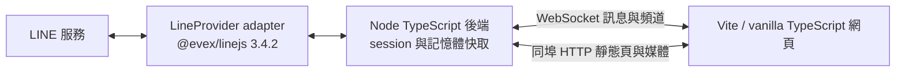
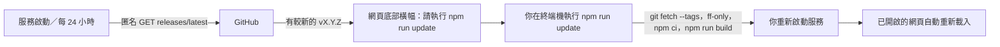

**繁體中文** ｜ [English](README.en.md) ｜ [日本語](README.ja.md)

# LINE.js

本機 TypeScript LINE 網頁客戶端，以釘選的 [@evex/linejs v3.4.2](https://github.com/evex-dev/linejs/tree/v3.4.2) 連線 LINE，經 WebSocket 同步頻道與訊息、同埠 HTTP 提供網頁。

> 開發狀態：QR 登入／登出、session 復用、頻道清單（好友與聊天分頁、大頭照）、即時與歷史訊息、文字／圖片／影片／貼圖發送（可貼上圖片或影片、可從已擁有的貼圖包選貼圖）、收到的圖片／GIF／影片／語音內嵌顯示、他人已讀、已讀回報與未讀數、社群管理員徽章、訊息內連結、系統訊息（例如「XX 新增 OO 至群組」）、斷線全畫面覆蓋、手機版漢堡選單、機器人 API（`/api/ws`）、終端機介面（CLI）與版本更新通知已可用。Gate 1 以次要帳號掃碼的驗收仍待小語確認。

## 定案用途與範圍

完整目標包含 QR 掃碼登入／登出、session 復用、好友／群組／聊天室／社群清單、即時訊息及編輯事件、歷史分頁、文字／圖片／貼圖發送，以及圖片／GIF／影片／語音／貼圖的顯示。檔案僅顯示佔位。不提供公開部署、多帳號、通話或套件發布；尚未交付的功能以 Gate 狀態為準。

本作品使用非官方 LINE API，可能造成帳號限制或封鎖。**請先用次要帳號驗證**，不要直接以主帳號測試。

**快速導覽**：[安裝與啟動](#安裝與啟動)｜[管理腳本](#管理腳本)｜[設定](#設定)｜[機器人 API](#機器人-apiapiws)｜[終端機介面（CLI）](#終端機介面cli)｜[版本更新](#版本更新)｜[安全政策](SECURITY.md)

## 目標系統架構（包含後續 Gate）



後端預設只綁定 `127.0.0.1`（可在 `config.yaml` 改，見〈設定〉），預設埠 `3789`。後端 `tsc` 建置至 `dist/`；前端 Vite 建置至 `dist/web/`。訊息只存記憶體（每頻道最多 500 則，同 id 去重，編輯覆寫），不使用資料庫；貼圖、大頭照與收到的媒體經後端以 LRU（預設 200MB）快取後由同埠 HTTP 提供。

## 環境需求

- Node.js **≥ 22** 與 npm。
- 可連線至 JSR、npm 與 LINE 的網路。
- 能掃描 QR 並確認 PIN 的 LINE 次要帳號。
- `@evex/linejs` 與 `@evex/linejs-types` 均固定 **3.4.2**（JSR）；其餘直接依賴也須釘選版本。

上游 3.4.2 的 Thrift 依賴包含 high 漏洞，本專案以 `overrides` 釘選修補版 `thrift@0.23.0`，不更動 LINE 套件版本。修補依據：[CVE-2026-41636](https://github.com/advisories/GHSA-r67j-r569-jrwp)。已以真實 LINE 帳號驗證登入復用、頻道清單與即時訊息相容。

## 安裝與啟動

```sh
git clone https://github.com/JS-PACKAGE/LINE.js.git
cd LINE.js
npm install
npm run build
npm start
```

也可以用根目錄的[管理腳本](#管理腳本)一次處理：`./linejs.sh start`（Windows：`.\linejs.ps1 start`）會在缺依賴或尚未建置時自動補齊再啟動。

開啟 `http://127.0.0.1:3789`。有可復用的 `session.json` 時直接進入聊天視窗；否則點「產生登入 QR code」，用次要帳號掃描並確認畫面 PIN。QR URL 與 PIN 只經 WebSocket 送給按下按鈕的那個連線一次，不入日誌或檔案；重新整理不會重播。失敗不自動循環，須再按按鈕。左側分「聊天」與「好友」兩個分頁（含大頭照與未讀數）；右側為訊息：連續同一人的訊息合併顯示頭像與名稱（名稱完整不斷行；社群管理員旁有皇冠、共同管理員旁有盾牌徽章）、時間（24 小時制）顯示在訊息後方、往上捲動載入更早的歷史、自己發的訊息在時間上方顯示「已讀」（1 對 1）或「已讀 N」（群組與聊天室；社群沒有已讀回執）、開啟有未讀的聊天會標出未讀分隔線。可傳送文字（Enter 送出、Shift+Enter 換行）、圖片（按「圖片」選檔，或直接在輸入框**貼上／拖入**圖片，先出現預覽再按送出；僅 PNG／JPEG／GIF）與貼圖（「貼圖」面板列出此帳號已擁有的貼圖包，點一下即送出；也可用 ID 手動送出）；收到的圖片／GIF 直接顯示（點擊放大）、影片按下播放才載入、語音可直接播放。位置、聯絡人、檔案與卡片訊息以小卡顯示 LINE 附帶的文字資訊（位置的名稱、地址與「在地圖上開啟」連結；聯絡人名稱；檔名與大小；卡片訊息的替代文字），檔案本身不提供下載；通話等其他類型只顯示類型佔位。**已讀回報**：聊天視窗開著且頁面可見時，會對 LINE 回報已讀到最新訊息（對方會看到「已讀」），可用 `chat.sendReadReceipts: false` 關閉。右上「登出」會先跳出確認框，確認後撤銷 LINE 端登入並清除 `session.json` 與快取。

**其他網頁行為**：
- **連結**：訊息文字中的 `http://`、`https://` 網址會變成可點的連結，在新分頁開啟（帶 `rel="noopener noreferrer"`，對方網站拿不到本頁，也不會收到 Referer）；句尾標點與多餘的右括號不算進網址，其他協定（如 `ftp://`）不轉連結。伺服器不會去抓取任何網址，也沒有連結預覽卡片（刻意不做：瀏覽器端受 CSP 與 CORS 限制讀不到，伺服器代抓則有 SSRF 與洩露 IP 的風險）。
- **系統訊息**：LINE 的成員異動事件（`CHATEVENT`，目前支援 `C_MI`）顯示為置中的灰色小膠囊，例如「XX 新增 OO 至群組」；其他未確認含義的事件類型一律顯示「［系統訊息］」佔位，不猜測內容。
- **收回**：對方（或你在其他裝置上）收回訊息時，該訊息改為「XX 已收回訊息」（自己的顯示「你已收回訊息」），引用它的回覆顯示「［已收回的訊息］」，圖片／影片／語音也不再提供下載；收回通知比訊息本身先到時同樣只顯示佔位。只處理本服務已收過的訊息 id，不依通知內容猜測是哪一則。
- **@ 提及**：收到的訊息裡被 @ 的人名以強調色顯示，@ 你或 @All 另加黃色底色；範圍以 LINE 附帶的提及資料為準，資料不合（超出文字、重疊）的部分不標示。社群裡你的成員 id 與帳號不同，因此社群中 @ 你的訊息只有一般強調色。
- **桌面通知**：左上「通知：關」按一下會向瀏覽器要求通知權限並開啟（設定存在瀏覽器的 localStorage，再按一次關閉）。只在頁面不在前景時通知他人傳來的新訊息；每個聊天室最多一則通知，新訊息會取代舊的；點通知回到頁面並開啟該聊天室，讀過後通知自動收起。通知內容（寄件者與訊息摘要）會出現在作業系統的通知中心。需要安全環境（`127.0.0.1`／`localhost` 或 HTTPS），其他 http 位址不顯示此按鈕。
- **斷線覆蓋**：與本機服務的 WebSocket 中斷時，整個畫面會被「與伺服器斷線」覆蓋；恢復後自動移除並重新同步訊息（沿用連線時的完整 snapshot，每個聊天室一個影格，頁面合併後一次重繪）。
- **手機版**：視窗寬度 ≤ 720px 時，聊天與好友清單收進左側抽屜，由對話標題列左上角的「☰」漢堡按鈕開啟（點背景或按 Esc 關閉，選取聊天室後自動關閉）；尚未選聊天室時預設展開。桌機版面不變。

可安裝為 PWA（瀏覽器「安裝」；含 favicon 與 manifest）。Service worker 只快取公開靜態檔，不碰 `/media/*` 與 `/ws`；頁面一律網路優先。網頁會鎖定瀏覽器原生右鍵選單（輸入欄位除外），右鍵改為訊息選單（聊天頻道上右鍵可顯示並複製頻道 ID），此為操作便利而非安全機制。聊天列表未讀數取自 LINE 端計數，開啟並回報已讀後清除。

`session.json` 包含憑證與 E2EE key material，必須以權限 `600` 保存，不得分享或提交。`config.yaml` 為個人設定，不入版本控制。`api-token.json`（機器人 Token 的 SHA-256 與建立時間，權限 `600`）與 `linejs.pid`（執行中服務的 PID，供 `stop`／`restart` 使用）同樣不入版本控制。

`src/line/session.ts` 的 SessionStorage 沿用 linejs FileStorage 契約，改以序列化、權限 `600` 的暫存檔與原子替換保存資料，避免併發寫入遺失 token／key。既有檔案會收緊權限；損壞 JSON 或 symlink 拒絕載入，不覆寫原資料。寫入失敗會使後續 `flush()` 失敗，不冒充 session 已保存。

### Gate 1 驗收

1. 啟動程序，在網頁以**次要 LINE 帳號**掃碼並完成 PIN 確認，網頁應自動進入聊天視窗。
2. 於 LINE 手機傳送一則訊息；60 秒內 terminal 出現 `LINE 訊息收到：id=… type=… kind=…`，該聊天室在網頁即時出現訊息與未讀數。只記錄識別資訊，不 dump 內容。
3. 停止並重新 `npm start`，確認 session 直接復用、不需再掃碼；`session.json` 權限仍為 `600`。

## 設定

`config.example.yaml` 已附逐項繁體中文說明。首次啟動若缺少 `config.yaml`，會以不覆寫既有檔案的方式自動建立；有個人設定時優先使用個人設定。欄位分為 `server`、`line`、`history`、`cache`、`chat`、`update`、`api`、`limits`（`chat`、`update`、`api` 區段與 `limits.downloadMaxBytes`、`limits.uploadVideoMaxBytes` 可省略，舊設定檔照常運作；`api` 預設關閉）。

- 監聽 host：預設且建議 `127.0.0.1`。以 `config.yaml` 為準，可改為其他主機名稱、IPv4 或 IPv6；程式不再強制本機迴路。網頁沒有帳號密碼，能連到該位址的人就能操作已登入的 LINE 帳號，啟動時非本機位址會印出警告。**不限制 `Host` 標頭**：不論監聽哪個位址，用任何 IP 或網域名稱連入都可以（例如反向代理、區網名稱、通道服務）；`Origin`、cookie 與 Token 檢查不變，`Sec-Fetch-Site: cross-site` 的請求仍拒絕。代價是不再防 DNS rebinding（攻擊者網域解析到本機位址時，該網頁與自己同源）。
- port：預設 `3789`，可調整；host 與 port 從 `config.yaml` 讀取，程式不得寫死。
- LINE 裝置：預設 `ANDROIDSECONDARY`。
- 歷史筆數：預設 50，單次最多 100。
- 每頻道訊息快取：最多 500 則；媒體 LRU：預設 200MB。
- WS frame：最多 256KB；文字：最多 8000 字。
- 發送：每 WS 連線最多每秒 5 次；媒體上傳：圖片每檔最多 10MB（PNG／JPEG／GIF）、影片每檔最多 50MB（MP4／MOV，`limits.uploadVideoMaxBytes` 可調，上限 200MB；影片整份暫存於記憶體）、每連線每分鐘最多 5 次。
- 收到的媒體：每個最多 50MB（`limits.downloadMaxBytes`），超過者只顯示類型標籤。
- 機器人 API：預設關閉；`api.enabled`、`api.chats`（必填、至少一個聊天室 id）、`api.sendsPerMinute`（預設 20、≤120）。細節見[機器人 API](#機器人-apiapiws)。

## 通訊協定

同埠 `ws://<host>:<port>/ws`（預設 `ws://127.0.0.1:3789/ws`；經 TLS 反向代理或自訂網域時網頁自動改用 `wss://`），JSON frames，單 frame 上限由 `limits.frameMaxBytes`（≤256KB）決定。升級須同時符合：路徑 `/ws`、`Origin`（`http` 或 `https`）的主機與 `Host` 相同、並帶有首頁下發的 HttpOnly／SameSite=Strict 瀏覽器 cookie；否則回 403。反向代理須轉發 WebSocket 升級標頭並保留原始 `Host`（nginx：`proxy_set_header Host $host;`、`proxy_set_header Upgrade $http_upgrade;`、`proxy_set_header Connection "upgrade";`）。完整負載見 [PLAN.md 第四節](PLAN.md)。

已提供：

| 方向 | type | 用途 |
|---|---|---|
| Server → Client | `hello` | 協定版本 2 與伺服器版本；收到後前端清空本機快取，等待完整 snapshot |
| Server → Client | `auth:state` | `restoring`／`idle`／`authenticating`／`ready`／`error` |
| Server → Client | `auth:qr` / `auth:pin` | 一次性，只送給發起 `auth:start` 的連線 |
| Server → Client | `auth:ready` | 登入完成與帳號資料；連線即送 snapshot（`channels`，以及記憶體中的訊息：每個聊天室一個 `messages` 影格） |
| Server → Client | `channels` | 頻道 snapshot；新增頻道或刷新後重送 |
| Server → Client | `messages` | 連線時的訊息 snapshot：`{ chatId, messages }`，每個聊天室一個影格（舊訊息，不計未讀） |
| Server → Client | `message` / `message:edit` | 即時訊息與覆寫既有訊息 |
| Server → Client | `message:unsend` | `{ chatId, messageId }`：該訊息已被收回，改顯示佔位（`Message.unsent: true`，不含內容） |
| Server → Client | `status` / `error` | LINE 監聽狀態與 generic 錯誤 |
| Server → Client | `history` / `sent` | 歷史一頁（含 `cursor`）／發送確認 |
| Server → Client | `read` | 他人已讀位置（開啟聊天的快照與即時增量） |
| Client → Server | `auth:start` / `auth:logout` | 開始 QR 登入／登出 |
| Client → Server | `history:fetch` / `message:send` | 載入歷史一頁／發送文字、圖片（先 `POST /media/upload`）或貼圖 |
| Client → Server | `stickers:list` → `stickers` | 取得此帳號已擁有的貼圖包與貼圖 id |
| Client → Server | `chat:read` | 回報已讀到某則訊息（無回應；僅限伺服器已顯示過的訊息，每個位置只送一次） |
| Client → Server | `message:send`（`mentions`／`replyTo`） | 發送文字時可附 @ 提及與回覆目標（右鍵訊息選單：回覆、@ 提及、複製文字；圖片另有複製圖片、下載圖片，影片可下載影片） |
| Client → Server | `channels:refresh` / `ping` | 重新載入頻道／連線保活 |
| Server → Client | `api:state` / `api:token` | 機器人 API 狀態（只給網頁）／剛產生的 Token（只送給要求的那個連線，僅此一次） |
| Client → Server | `api:token:create` / `api:token:revoke` | 產生或撤銷機器人 Token（僅網頁連線可用，機器人不行） |

HTTP：`GET /media/:mediaId`（貼圖、貼圖包圖示、大頭照與原圖、收到的圖片／影片／語音；支援 Range）與 `POST /media/upload`（圖片／影片上傳）皆需瀏覽器 cookie 與同源。WS 不傳媒體位元組。

### 機器人 API（`/api/ws`）

讓你自己的程式（機器人）收發訊息。**預設關閉**，啟用需要三步：

1. 在 `config.yaml` 加入並**重啟服務**（範本見 `config.example.yaml`）：
   ```yaml
   api:
     enabled: true
     chats:                      # 機器人可存取的聊天室 id，至少一個；未列出的聊天室對機器人視為不存在
       - c0123456789abcdef0123456789abcdef
     sendsPerMinute: 20          # 所有機器人合計每分鐘最多發送幾則（1～120，可省略，預設 20）
   ```
   `enabled: true` 卻沒有有效的 `chats` 時，服務啟動會直接失敗（避免「空清單＝全部」的誤會）。
2. 產生 Token：`npm run cli -- token`（見 [CLI `token`](#token重新產生或撤銷機器人-api-token)）。Token 只顯示**一次**，伺服器只保存 SHA-256（`api-token.json`，權限 600，不入版控），之後無法再查看，忘記就重新產生。網頁沒有 Token 管理介面，只能用 CLI。
3. 機器人連到 `ws://<host>:<port>/api/ws`（預設 `ws://127.0.0.1:3789/api/ws`），帶標頭 `Authorization: Bearer <Token>`。

**連線規則**
- 升級須同時符合：`api.enabled`、**不可帶 `Origin`**（瀏覽器的 WebSocket 一定會帶，所以任何網頁都無法使用這個入口，即使 Token 外洩到網頁也一樣）、Token 正確（以固定時間比對）。失敗一律回 403，不透露是哪一項；同時最多 4 個連線，超過回 429。
- 換 Token 或撤銷會**立即**中斷所有機器人連線（close code 1008），舊 Token 不再有效。

**可以做什麼（影格白名單）**

| 方向 | type | 說明 |
|---|---|---|
| 機器人 → 服務 | `message:send` | `{ requestId, chatId, text, mentions?, replyTo? }`：**只能文字**；`mediaId`／`sticker` 回 `INVALID_REQUEST`。成功回 `sent { requestId, messageId }` |
| 機器人 → 服務 | `history:fetch` | `{ requestId, chatId, limit?, before? }`：與網頁相同的分頁，但不附已讀快照 |
| 機器人 → 服務 | `ping` | 保活 |
| 服務 → 機器人 | `hello`、`auth:state`、`status` | 連線即送；`auth:state` 不是 `ready`（LINE 尚未登入）時還不能收發 |
| 服務 → 機器人 | `auth:ready` | 含自己的 `profile.userId`，用來略過自己發的訊息（你在手機上發的也會是這個 id） |
| 服務 → 機器人 | `channels` | 只含 `api.chats` 內的聊天室；有變動時重送 |
| 服務 → 機器人 | `message`、`message:edit`、`message:unsend` | 只有 `api.chats` 內聊天室的**即時**訊息、編輯與收回；包含你自己發的 |
| 服務 → 機器人 | `sent`、`history`、`error` | 對應請求的回應；錯誤只有 generic 代碼（`UNKNOWN_CHAT`、`INVALID_REQUEST`、`RATE_LIMITED`、`SEND_FAILED`…） |

其餘一律回 `UNKNOWN_TYPE`：沒有登入／登出、`chat:read`（已讀回報）、`channels:refresh`、貼圖清單、Token 管理。**不重播舊訊息**（機器人從「現在」開始，不會重複回應歷史；要歷史請用 `history:fetch`）；不給 `read`、`update:available`、`api:state`；圖片／影片等媒體位元組也無法取得（機器人只看到訊息的 `contentType`）。

**頻率與風險**
- 每個連線受 `limits.sendsPerSecond`（≤5）限制，且所有機器人合計每分鐘不超過 `api.sendsPerMinute`；超過回 `RATE_LIMITED`。
- 機器人以**你的真人帳號**發言，頻繁或機械式的發送可能觸發 LINE 風控。請保守設定上限，並先用次要帳號。

```js
import WebSocket from "ws";
const ws = new WebSocket("ws://127.0.0.1:3789/api/ws", { headers: { Authorization: `Bearer ${process.env.LINEJS_TOKEN}` } });
let me;
ws.on("message", (data) => {
  const frame = JSON.parse(data);
  if (frame.type === "auth:ready") me = frame.profile.userId;
  if (frame.type === "message" && frame.message.senderId !== me && frame.message.text === "ping") {
    ws.send(JSON.stringify({ type: "message:send", requestId: "r1", chatId: frame.message.channelId, text: "pong" }));
  }
});
```

## 終端機介面（CLI）

不開網頁也能登入、登出與換 Token。CLI **不直接碰 `session.json`**，而是連到**正在執行**的服務：先 `GET /` 取得瀏覽器 cookie，再用同一個 WebSocket（`/ws`）與網頁同樣的流程操作，所以所有安全檢查與狀態都只有一份，網頁與 CLI 看到的登入狀態一致。服務位址取自 `config.yaml` 的 `server`（綁定 `0.0.0.0` 時改連本機迴路）。

**前置**：先 `npm start`，並且已 `npm run build`（CLI 執行的是建置後的 `dist/`）。

```sh
npm run cli -- login     # 登入
npm run cli -- logout    # 登出
npm run cli -- token     # 重新產生機器人 API Token（加 --revoke 則撤銷）
npm run cli              # 不帶指令：顯示用法
```

> `npm run cli` 後面的 `--` 不能省，否則後面的參數會被 npm 吃掉。

**選項**：`--yes`（或 `-y`）略過確認。沒有終端機的環境（腳本、排程）無法詢問，**必須**加 `--yes`，否則會拒絕執行。`--revoke` 只能與 `token` 搭配，其他組合視為用法錯誤（結束碼 2）。

### `login`：登入並在終端機顯示 QR code

1. 連上服務；若服務還在還原 session，先等它完成。
2. 已經登入 → 印「已經登入。」與「已登入：<名稱>」後結束，不做任何事。
3. 否則發起 QR 登入，等 LINE 產生 QR code，在終端機以方塊字元畫出 QR code，**用次要帳號的 LINE** 掃描。
4. 掃描後手機會要求輸入 PIN，PIN 會印在 QR code 下方。
5. LINE 確認後印「已登入：<名稱>」並結束；網頁若開著也會同步進入聊天畫面。

- QR code 與 PIN **只畫在執行指令的那個終端機**：不寫入檔案、不入日誌，也不會廣播給網頁或其他連線（QR 的原始網址本身不會被印出）。
- 最久等 3 分鐘；失敗或逾時要重新執行（不會自動循環）。
- 網頁或另一個終端機已經在登入時，會回報「目前無法開始登入：已有登入程序在進行」，請在那邊完成。

### `logout`：登出

1. 未登入 → 印「目前沒有登入的 LINE 帳號。」，不做任何事。
2. 已登入 → 先確認：「登出會清除本機登入資料與快取，並登出此裝置；下次需要重新掃描 QR code。確定登出？(y/N)」。
3. 確認後撤銷 LINE 端登入、清除 `session.json` 與記憶體快取，印「已登出。」。若 LINE 端無法確認登出，會額外提醒到手機 LINE 的「登入中的裝置」手動移除此裝置。

### `token`：重新產生或撤銷機器人 API Token

- 需先在 `config.yaml` 啟用 `api`（見[機器人 API](#機器人-apiapiws)），否則回「機器人 API 未啟用」。
- 已有 Token 時先確認：「目前的 Token 會立即失效，使用它的機器人會被中斷連線。確定重新產生？」。
- 新 Token **單獨印在標準輸出**，其餘訊息（說明、警告）印在標準錯誤，因此可以直接指派給變數；Token 只顯示這一次：

  ```sh
  LINEJS_TOKEN=$(npm run -s cli -- token --yes)   # -s 讓 npm 不印自己的標頭，輸出才乾淨
  ```
- `token --revoke`：撤銷目前的 Token、不產生新的。會先確認（「撤銷後機器人會被中斷連線，且在重新產生前無法再連線。確定撤銷？」），確認後立即中斷所有機器人連線並刪除 `api-token.json`；沒有 Token 時印「目前沒有 Token，不需撤銷。」並以 0 結束。
- 只有取得瀏覽器 cookie 的一般 `/ws` 連線（也就是本機 CLI）能產生／撤銷；機器人連線自己不能換 Token。Token 只會送給發出要求的那一個連線。

### 結束碼與常見訊息

| 結束碼 | 意義 |
|---|---|
| 0 | 成功；或使用者取消確認、目前未登入（`logout`）、已經登入（`login`）；或不帶指令顯示用法 |
| 1 | 失敗：連不上服務、被服務拒絕、登入失敗／逾時、API 未啟用、與服務連線中斷等 |
| 2 | 指令或選項不正確（會附用法） |

| 訊息 | 原因與處理 |
|---|---|
| 連不上服務（http://…）。請先執行 npm start。 | 服務沒開，或 `config.yaml` 的 `server.host`／`port` 與服務實際使用的不同 |
| 服務拒絕了連線，請確認 config.yaml 的 server.host 與 server.port。 | 連到的不是本服務（例如埠被別的程式佔用），或服務拒絕了該請求 |
| 服務與 CLI 的通訊協定版本不同… | 程式更新後沒有重建或重啟：`npm run build` 並重新啟動服務 |
| 非互動環境無法確認；若確定要執行，請加上 --yes。 | 沒有終端機卻需要確認 |
| 機器人 API 未啟用… | 依上節設定 `api.enabled` 與 `api.chats`，重啟後再試 |
| 登入失敗，請重新執行 login。 | QR 逾時、PIN 錯誤或 LINE 拒絕；重新執行 |

## 管理腳本

根目錄的 `linejs.sh` 與 `linejs.ps1` 是功能相同的兩支腳本，把常用操作收成同一組指令：`linejs.sh`（macOS／Linux，POSIX `sh`）與 `linejs.ps1`（Windows PowerShell 5.1／PowerShell 7）。可從任何目錄呼叫，腳本會先切到專案根目錄。

```sh
./linejs.sh start            # 啟動服務（前景執行，Ctrl+C 停止）
./linejs.sh stop             # 停止正在執行的服務
./linejs.sh restart          # 停止後重新啟動（沒在執行時等同 start）
./linejs.sh update           # 更新到最新版（可加 --check、--verify）
./linejs.sh login            # 登入：在終端機顯示 QR code
./linejs.sh logout           # 登出並清除本機登入資料
./linejs.sh token            # 重設機器人 API Token（新 Token 只顯示一次）
./linejs.sh help             # 顯示用法
```

```powershell
.\linejs.ps1 start           # 其餘指令相同：stop／restart／update／login／logout／token／help
# 若系統禁止執行腳本：powershell -ExecutionPolicy Bypass -File .\linejs.ps1 start
```

| 指令 | 實際執行 | 說明 |
|---|---|---|
| `start` | `node dist/main.js` | 不接受參數。`node_modules` 與 `package-lock.json` 不一致（缺套件、版本不符，例如安裝中斷或 lockfile 已更新）時先 `npm ci --include=dev` 再 `npm run build`；沒有建置輸出（`dist/main.js`、`dist/web/index.html`），或原始碼（`src/`、`web/`、`package.json`、`package-lock.json`、`tsconfig.json`）比建置輸出新（例如只 `git pull` 了程式碼）時先 `npm run build`；兩者都是最新時不做任何事，直接啟動。前景執行，Ctrl+C 停止。服務已在執行時拒絕再啟動，並提示改用 `restart` |
| `stop` | `node scripts/service.mjs stop` | 不接受參數。依 `linejs.pid` 找到服務，送出結束訊號（`SIGTERM`，服務會先關閉 LINE 連線並寫好 `session.json` 再結束），最多等 20 秒；沒有在執行也回報成功 |
| `restart` | `stop` 再 `start` | 不接受參數。先停止正在執行的服務（沒有在執行就略過），再以前景啟動，接手目前這個終端機；原本那個終端機裡的服務會結束 |
| `update` | `node scripts/update.mjs …` | 即 `npm run update`，選項原樣傳入：`--check` 只檢查、`--verify` 要求 tag 簽章。流程與中止條件見[版本更新](#版本更新)；更新完要重新執行 `start` |
| `login`／`logout`／`token` | `node scripts/cli.mjs <指令> …` | 即 `npm run cli -- <指令>`，選項（如 `--yes`）原樣傳入。**服務需已啟動**（另開一個終端機跑 `start`），細節與結束碼見[終端機介面（CLI）](#終端機介面cli)。依賴或建置已過期時不會在執行中的服務底下重新安裝或建置，而是提示先 `restart` |

- 腳本先檢查 Node.js ≥ 22 與 npm，不符就以清楚訊息中止；結束碼原樣回傳（未知指令為 2）。
- **`stop`／`restart` 怎麼找到服務**：服務啟動後把自己的 PID 寫進專案根目錄的 `linejs.pid`（權限 600、不入版控），正常結束時移除。腳本只會終止「`linejs.pid` 指向、**且命令列確實是本專案 `dist/main.js`**」的程序：PID 檔過期（服務當機沒清檔、或該 PID 已被別的程式沿用）時只會清掉檔案，不會碰那個程序。
- 這個機制從加入 `linejs.pid` 的版本開始：更新後第一次請手動停止舊的服務（Ctrl+C），之後用 `start` 啟動的服務才能被 `stop`／`restart` 找到；在 Windows 上沒有訊號機制，`stop` 會直接結束程序（`session.json` 的寫入是原子的，不會留下寫到一半的檔案）。
- `stop` 在 20 秒內等不到服務結束時回報失敗並附上 PID，請自行檢查後手動終止，腳本不會強制殺掉。
- `token` 與 `npm run cli -- token` 一樣只把新 Token 印在標準輸出，可以直接取用：`LINEJS_TOKEN=$(./linejs.sh token --yes)`（PowerShell：`$env:LINEJS_TOKEN = .\linejs.ps1 token --yes`）。因為腳本直接呼叫 `node`，不經 `npm run`，輸出不會夾帶 npm 的標頭。
- 腳本只是上述指令的捷徑，不含任何額外權限；`session.json`、`config.yaml` 與 `api-token.json` 的處理方式完全不變。

## 建置與驗證

以下命令已提供；`npm test` 會先建置，再以隔離的假 provider 測試設定、session、登入／登出、訊息快取、歷史與發送驗證與限流、媒體路由（含 Range）、已讀與 WS 安全：

```sh
npm run typecheck
npm run build
npm test
npm audit
```

測試使用 `node --test` 與 Mock Provider；Mock 不代替真實 LINE 驗收。Gate 1 需要次要帳號掃碼後 60 秒內收到一則真實訊息，Gate 2–4 另驗證網頁同步、歷史、發送與媒體。全部 Gate 及驗收條件見 [PLAN.md](PLAN.md)。

已驗證：typecheck、build、123 項測試、`npm audit` 無 high。真實 LINE 帳號：session 復用、頻道清單、好友／群組／社群的即時訊息、talk 歷史分頁（無重複、有序、可翻到底）、OpenChat 歷史分頁、大頭照與非好友名稱查詢、OpenChat 圖片下載與顯示、已擁有貼圖包列表（7 包、含繁中名稱與圖示）、社群訊息的管理員／共同管理員角色辨識、網頁上重新掃碼登入（服務日誌出現 QR 登入流程，換成另一個帳號）。瀏覽器以假 provider 驗證：往上翻頁、輸入與發送流程、貼上圖片預覽並送出（含接著送文字）、拒絕貼上影片、已擁有貼圖面板（分頁、點選即送）、圖片上傳、頭像與備援字母、已讀／未讀標示、已讀回報的觸發、徽章與完整暱稱不斷行、時間在訊息後與 24 小時制（00:05 不顯示 24:05）、圖片放大、影片（Range）與語音播放、確認對話框、發送後捲到最底（含回覆者 id 與自己不同的社群情況）與收到貼圖時維持在底部、新版本橫幅（關閉後記住）、服務版本與頁面版本不同時的重新整理提示、服務重啟後舊分頁自動重新載入。**機器人 API、CLI 與其他新增項目**：以假 provider 的自動測試涵蓋認證（缺 Token／錯誤 Token／帶 `Origin`／錯誤 `Host`）、影格白名單、聊天室範圍、不重播舊訊息、全域發送上限、最多 4 連線、換／撤銷 Token 立即斷線、Token 只存雜湊與檔案權限、CLI 的 `login`（QR 與 PIN 只在終端機）／`logout`／`token`／`token --revoke`（撤銷、無 Token 時不動作、`--revoke` 與其他指令搭配視為用法錯誤）；CLI 對真實服務只跑了無副作用的 `login`（已登入時回報狀態）與未啟用 API 時的 `token` 錯誤；「XX 新增 OO 至群組」以真實帳號的歷史訊息驗證解析與名稱。**尚未驗證**（需要對真實聯絡人產生副作用或對應的真實訊息）：機器人 API 實際對 LINE 發送與接收即時訊息、CLI `logout` 與真實 QR 掃描登入流程、系統訊息的即時事件路徑（只驗證了歷史）、綁定非本機位址的實際使用、真實的文字／貼圖／圖片發送、真實的已讀回報（`sendChatChecked`／OpenChat `markAsRead` 對 LINE 的效果）、LINE 端登出的伺服器確認、E2EE 圖片的接收解密、1:1 已讀事件欄位格式（已知形狀不符時會忽略）、GIF 與影片的真實來源、listen 中斷後的退避重連；`npm run update` 的完整流程只以暫時的 git 倉庫與假 `npm` 驗證，尚未對真實的新版本跑過（倉庫目前最新 Release 為 v0.9.0，更新通知對真實 GitHub Release API 的查詢已實測）。

## 版本更新

版本號以 `package.json` 為準，採 semver，發佈為 GitHub Release／tag `vX.Y.Z`（push tag 與發佈 Release 須維護者明示授權）。更新機制刻意分成**自動通知**與**手動更新**兩段：**LINE.js 不會自己下載或執行任何新程式碼**。



### 1. 通知（自動，只提示）

- **時機**：服務啟動時一次，之後每 24 小時一次。
- **請求**：匿名 `GET https://api.github.com/repos/JS-PACKAGE/LINE.js/releases/latest`。不送憑證、cookie、LINE 資料或任何識別資訊（除了 HTTPS 本身會揭露的 IP 與固定的 `User-Agent: LINE.js-update-check`）。
- **嚴格解析**：只認 `X.Y.Z`／`vX.Y.Z`；pre-release 與 draft 忽略；Release 連結必須指向本專案的 `/releases/` 才會顯示；Release 說明是不受信任內容，不轉發；不跟隨轉址；回應大小有上限。倉庫沒有任何 Release（404）視為「無新版」。
- **顯示**：網頁底部出現橫幅「有新版本 vX.Y.Z 可用（目前 vA.B.C）。請在終端機執行 `npm run update`，完成後重新啟動服務。」附「版本說明」連結。可按 ✕ 關閉，同一版本記在瀏覽器（`localStorage`）不再提示，更新的版本出現時會再提示。
- **失敗**：網路或 GitHub 失敗時以 5、10、20 分鐘…退避重試，上限為 24 小時，不會連續狂打。
- **關閉**：`config.yaml` 設 `update.check: false`，完全不對外查詢。

### 2. 更新（由你主動執行）

```sh
npm run update                  # 更新到最新版，並重新安裝依賴、建置
npm run update -- --check       # 只檢查有沒有新版，不改動任何東西
npm run update -- --verify      # 更新前額外要求最新 tag 通過 git verify-tag（需維護者簽署該 tag）
```

`npm run update` 依序做這些事，任何一步失敗就中止並說明原因：

1. 確認在 git 倉庫內、有 `origin` 遠端，且 `package.json` 的版本可辨識。
2. 確認**已追蹤的檔案沒有未提交的修改**（未追蹤的 `config.yaml`、`session.json`、`api-token.json` 不受影響，也不會被動到）。
3. `git fetch --tags origin`，在所有 `vX.Y.Z` tag 中找出最新的。
4. 沒有比目前版本新的就結束（「已是最新版」）；`--check` 到這裡就結束。
5. `--verify`：`git verify-tag` 必須通過。
6. 目前的提交必須是該 tag 的祖先，才以 **fast-forward** 前進（只做 `merge --ff-only`；在 detached HEAD 時改為 `checkout --detach` 該 tag）。本機有該 tag 沒有包含的提交時中止，請自行 merge／rebase 後再更新，**不會覆寫你的內容**。
7. `npm ci --include=dev`（依鎖檔安裝釘選的依賴；建置需要 devDependencies，`NODE_ENV=production` 時也照裝）。
8. `npm run build`。
9. 提示「已更新到 vX.Y.Z，請重新啟動服務」。

重新啟動：在跑 `npm start` 的終端機按 Ctrl+C，再 `npm start`。`session.json` 會復用，不需要重新掃碼。如果第 7、8 步失敗，程式碼已切到新版，訊息會附上退回指令（`git checkout <舊提交>`，再 `npm ci --include=dev && npm run build`）。

- **沒有網頁一鍵更新**：這是刻意的，避免網頁層的任何漏洞升級為遠端程式碼執行。
- **信任模型**：更新信任 `origin` 遠端與 GitHub 的 TLS；tag 只有在使用 `--verify` 且維護者簽署時才有密碼學驗證。需要更高保證的人，更新前請自行檢視兩個 tag 之間的差異。
- 尚未有此功能的舊版本（v0.9.0 之前）請先手動 `git pull` 一次。

### 3. 頁面同步（自動）

- 服務重啟後，已開啟的分頁會自動重新載入（舊 cookie 失效後，連續被拒三次且服務可連時才會重載，每 30 秒最多一次，避免服務真的掛掉時一直重載）。
- 頁面版本與服務版本不同時，會提示「本機服務已更新到 vX（此頁為 vY），請重新整理」；通訊協定版本不相容時，直接重新載入。

### 4. 發佈新版（維護者）

1. 更新 `package.json` 的 `version`，提交（例如 `release: vX.Y.Z`）。
2. 建立 tag `vX.Y.Z`（建議簽署）並 push；在 GitHub 建立對應的 Release（非 pre-release）。
3. 使用者的服務在下一次檢查（最久 24 小時，或重啟時）就會看到通知。

以上 push、tag 與 Release 都屬於對外動作，須維護者明示授權。

安全政策與回報方式見 [SECURITY.md](SECURITY.md)。

## 開發規範與授權

工程與安全規範見 [AGENTS.md](AGENTS.md)，定案企劃全文見 [PLAN.md](PLAN.md)。依功能分批提交，不混入個人設定或憑證；不得改寫既有 `LICENSE`、`.nojekyll`。

本作品 **LINE.js** 採 **Apache-2.0**，以根目錄 [LICENSE](LICENSE) 為準。消費套件 **@evex/linejs** 與 **@evex/linejs-types** 採 **MIT**，其授權獨立於本作品，詳見 [上游授權](https://github.com/evex-dev/linejs/blob/v3.4.2/LICENSE)。本倉庫僅供 clone，不發布 npm／JSR 套件。
