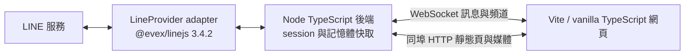

# LINE.js

本機 TypeScript LINE 網頁客戶端，以釘選的 [@evex/linejs v3.4.2](https://github.com/evex-dev/linejs/tree/v3.4.2) 連線 LINE，經 WebSocket 同步頻道與訊息、同埠 HTTP 提供網頁。

> 開發狀態：QR 登入／登出、session 復用、頻道清單（好友與聊天分頁、大頭照）、即時與歷史訊息、文字／圖片／影片／貼圖發送（可貼上圖片或影片、可從已擁有的貼圖包選貼圖）、收到的圖片／GIF／影片／語音內嵌顯示、他人已讀、已讀回報與未讀數、社群管理員徽章已可用。Gate 1 以次要帳號掃碼的驗收仍待小語確認。

## 定案用途與範圍

完整目標包含 QR 掃碼登入／登出、session 復用、好友／群組／聊天室／社群清單、即時訊息及編輯事件、歷史分頁、文字／圖片／貼圖發送，以及圖片／GIF／影片／語音／貼圖的顯示。檔案僅顯示佔位。不提供公開部署、多帳號、通話或套件發布；尚未交付的功能以 Gate 狀態為準。

本作品使用非官方 LINE API，可能造成帳號限制或封鎖。**請先用次要帳號驗證**，不要直接以主帳號測試。

## 目標系統架構（包含後續 Gate）



後端預設只綁定 `127.0.0.1`（可在 `config.yaml` 改，見〈設定〉），預設埠 `3789`。後端 `tsc` 建置至 `dist/`；前端 Vite 建置至 `dist/web/`。訊息只存記憶體（每頻道最多 500 則，同 id 去重，編輯覆寫），不使用資料庫；貼圖、大頭照與收到的媒體經後端以 LRU（預設 200MB）快取後由同埠 HTTP 提供。

## 環境需求

- Node.js **≥ 22** 與 npm。
- 可連線至 JSR、npm 與 LINE 的網路。
- 能掃描 QR 並確認 PIN 的 LINE 次要帳號。
- `@evex/linejs` 與 `@evex/linejs-types` 均固定 **3.4.2**（JSR）；其餘直接依賴也須釘選版本。

上游 3.4.2 的 Thrift 依賴包含 high 漏洞，本專案以 `overrides` 釘選修補版 `thrift@0.23.0`，不更動 LINE 套件版本。修補依據：[CVE-2026-41636](https://github.com/advisories/GHSA-r67j-r569-jrwp)。已以真實 LINE 帳號驗證登入復用、頻道清單與即時訊息相容。

## 安裝與啟動

```sh
git clone https://github.com/JS-PACKAGE/LINE.js.git
cd LINE.js
npm install
npm run build
npm start
```

開啟 `http://127.0.0.1:3789`。有可復用的 `session.json` 時直接進入聊天視窗；否則點「產生登入 QR code」，用次要帳號掃描並確認畫面 PIN。QR URL 與 PIN 只經 WebSocket 送給按下按鈕的那個連線一次，不入日誌或檔案；重新整理不會重播。失敗不自動循環，須再按按鈕。左側分「聊天」與「好友」兩個分頁（含大頭照與未讀數）；右側為訊息：連續同一人的訊息合併顯示頭像與名稱（名稱完整不斷行；社群管理員旁有皇冠、共同管理員旁有盾牌徽章）、時間（24 小時制）顯示在訊息後方、往上捲動載入更早的歷史、自己發的訊息顯示「已讀」或「已讀 N」、開啟有未讀的聊天會標出未讀分隔線。可傳送文字（Enter 送出、Shift+Enter 換行）、圖片（按「圖片」選檔，或直接在輸入框**貼上／拖入**圖片，先出現預覽再按送出；僅 PNG／JPEG／GIF）與貼圖（「貼圖」面板列出此帳號已擁有的貼圖包，點一下即送出；也可用 ID 手動送出）；收到的圖片／GIF 直接顯示（點擊放大）、影片按下播放才載入、語音可直接播放。檔案等僅顯示類型佔位。**已讀回報**：聊天視窗開著且頁面可見時，會對 LINE 回報已讀到最新訊息（對方會看到「已讀」），可用 `chat.sendReadReceipts: false` 關閉。右上「登出」會先跳出確認框，確認後撤銷 LINE 端登入並清除 `session.json` 與快取。

可安裝為 PWA（瀏覽器「安裝」；含 favicon 與 manifest）。Service worker 只快取公開靜態檔，不碰 `/media/*` 與 `/ws`；頁面一律網路優先。網頁會鎖定瀏覽器原生右鍵選單（輸入欄位除外），右鍵改為訊息選單，此為操作便利而非安全機制。聊天列表未讀數取自 LINE 端計數，開啟並回報已讀後清除。

`session.json` 包含憑證與 E2EE key material，必須以權限 `600` 保存，不得分享或提交。`config.yaml` 為個人設定，不入版本控制。

`src/line/session.ts` 的 SessionStorage 沿用 linejs FileStorage 契約，改以序列化、權限 `600` 的暫存檔與原子替換保存資料，避免併發寫入遺失 token／key。既有檔案會收緊權限；損壞 JSON 或 symlink 拒絕載入，不覆寫原資料。寫入失敗會使後續 `flush()` 失敗，不冒充 session 已保存。

### Gate 1 驗收

1. 啟動程序，在網頁以**次要 LINE 帳號**掃碼並完成 PIN 確認，網頁應自動進入聊天視窗。
2. 於 LINE 手機傳送一則訊息；60 秒內 terminal 出現 `LINE 訊息收到：id=… type=… kind=…`，該聊天室在網頁即時出現訊息與未讀數。只記錄識別資訊，不 dump 內容。
3. 停止並重新 `npm start`，確認 session 直接復用、不需再掃碼；`session.json` 權限仍為 `600`。

## 設定

`config.example.yaml` 已附逐項繁體中文說明。首次啟動若缺少 `config.yaml`，會以不覆寫既有檔案的方式自動建立；有個人設定時優先使用個人設定。欄位分為 `server`、`line`、`history`、`cache`、`chat`、`update`、`api`、`limits`（`chat`、`update`、`api` 區段與 `limits.downloadMaxBytes`、`limits.uploadVideoMaxBytes` 可省略，舊設定檔照常運作；`api` 預設關閉）。

- 監聽 host：預設且建議 `127.0.0.1`。以 `config.yaml` 為準，可改為其他主機名稱、IPv4 或 IPv6；程式不再強制本機迴路。網頁沒有帳號密碼，能連到該位址的人就能操作已登入的 LINE 帳號，啟動時非本機位址會印出警告；`Host` 標頭須等於設定的「位址:埠」或 `localhost:埠`。
- port：預設 `3789`，可調整；host 與 port 從 `config.yaml` 讀取，程式不得寫死。
- LINE 裝置：預設 `ANDROIDSECONDARY`。
- 歷史筆數：預設 50，單次最多 100。
- 每頻道訊息快取：最多 500 則；媒體 LRU：預設 200MB。
- WS frame：最多 256KB；文字：最多 8000 字。
- 發送：每 WS 連線最多每秒 5 次；媒體上傳：圖片每檔最多 10MB（PNG／JPEG／GIF）、影片每檔最多 50MB（MP4／MOV，`limits.uploadVideoMaxBytes` 可調，上限 200MB；影片整份暫存於記憶體）、每連線每分鐘最多 5 次。
- 收到的媒體：每個最多 50MB（`limits.downloadMaxBytes`），超過者只顯示類型標籤。

## 通訊協定

同埠 `ws://<host>:<port>/ws`（預設 `ws://127.0.0.1:3789/ws`），JSON frames，單 frame 上限由 `limits.frameMaxBytes`（≤256KB）決定。升級須同時符合：路徑 `/ws`、`Host` 為設定的位址、`Origin` 與 `Host` 相同、並帶有首頁下發的 HttpOnly／SameSite=Strict 瀏覽器 cookie；否則回 403。完整負載見 [PLAN.md 第四節](PLAN.md)。

已提供：

| 方向 | type | 用途 |
|---|---|---|
| Server → Client | `hello` | 協定版本 1 與伺服器版本；收到後前端清空本機快取，等待完整 snapshot |
| Server → Client | `auth:state` | `restoring`／`idle`／`authenticating`／`ready`／`error` |
| Server → Client | `auth:qr` / `auth:pin` | 一次性，只送給發起 `auth:start` 的連線 |
| Server → Client | `auth:ready` | 登入完成與帳號資料；連線即送 snapshot（`channels` 與記憶體中的訊息） |
| Server → Client | `channels` | 頻道 snapshot；新增頻道或刷新後重送 |
| Server → Client | `message` / `message:edit` | 即時訊息與覆寫既有訊息 |
| Server → Client | `status` / `error` | LINE 監聽狀態與 generic 錯誤 |
| Server → Client | `history` / `sent` | 歷史一頁（含 `cursor`）／發送確認 |
| Server → Client | `read` | 他人已讀位置（開啟聊天的快照與即時增量） |
| Client → Server | `auth:start` / `auth:logout` | 開始 QR 登入／登出 |
| Client → Server | `history:fetch` / `message:send` | 載入歷史一頁／發送文字、圖片（先 `POST /media/upload`）或貼圖 |
| Client → Server | `stickers:list` → `stickers` | 取得此帳號已擁有的貼圖包與貼圖 id |
| Client → Server | `chat:read` | 回報已讀到某則訊息（無回應；僅限伺服器已顯示過的訊息，每個位置只送一次） |
| Client → Server | `message:send`（`mentions`／`replyTo`） | 發送文字時可附 @ 提及與回覆目標（右鍵訊息選單：回覆、@ 提及、複製文字） |
| Client → Server | `channels:refresh` / `ping` | 重新載入頻道／連線保活 |
| Server → Client | `api:state` / `api:token` | 機器人 API 狀態（只給網頁）／剛產生的 Token（只送給要求的那個連線，僅此一次） |
| Client → Server | `api:token:create` / `api:token:revoke` | 產生或撤銷機器人 Token（僅網頁連線可用，機器人不行） |

HTTP：`GET /media/:mediaId`（貼圖、貼圖包圖示、大頭照與原圖、收到的圖片／影片／語音；支援 Range）與 `POST /media/upload`（圖片／影片上傳）皆需瀏覽器 cookie 與同源。WS 不傳媒體位元組。

### 機器人 API（`/api/ws`）

讓你自己的程式（機器人）收發訊息。預設關閉；在 `config.yaml` 設 `api.enabled: true` 並列出 `api.chats`（機器人可存取的聊天室 id，至少一個），重啟後網頁側邊欄會出現「API」按鈕：

1. 按「產生 Token」（或用 CLI：`npm run cli -- token`）。Token 只顯示**一次**，請立即複製；伺服器只保存 SHA-256（`api-token.json`，權限 600，不入版控），之後無法再查看。「重新產生」或「撤銷」會立即中斷所有機器人連線。
2. 機器人連到 `ws://<host>:<port>/api/ws`，帶標頭 `Authorization: Bearer <Token>`，**不可帶 `Origin`**（瀏覽器一定會帶，所以網頁無法使用此入口）；`Host` 須符合上述規則。失敗一律回 403；同時最多 4 個連線（超過回 429）。
3. 可用影格只有：`message:send`（僅文字，可含 `mentions`／`replyTo`；不支援圖片、貼圖）、`history:fetch`、`ping`；其餘一律回 `UNKNOWN_TYPE`。不提供登入／登出、`chat:read`（已讀回報）與 `channels:refresh`。
4. 機器人只看得到 `api.chats` 內的聊天室：連線時收到 `hello`、`auth:state`、`status`、`auth:ready`（含自己的 `userId`，用來略過自己發的訊息）與過濾後的 `channels`，之後只收到這些聊天室的即時 `message`／`message:edit`。**不重播舊訊息**；不給 `read`、`update:available`、`api:state`。未列出的聊天室一律回 `UNKNOWN_CHAT`。
5. 頻率：每連線 `limits.sendsPerSecond`（≤5）／秒，且所有機器人合計每分鐘 `api.sendsPerMinute`（預設 20，≤120）則。自動發送可能觸發 LINE 風控，請保守設定，並先用次要帳號。

```js
import WebSocket from "ws";
const ws = new WebSocket("ws://127.0.0.1:3789/api/ws", { headers: { Authorization: `Bearer ${process.env.LINEJS_TOKEN}` } });
let me;
ws.on("message", (data) => {
  const frame = JSON.parse(data);
  if (frame.type === "auth:ready") me = frame.profile.userId;
  if (frame.type === "message" && frame.message.senderId !== me && frame.message.text === "ping") {
    ws.send(JSON.stringify({ type: "message:send", requestId: "r1", chatId: frame.message.channelId, text: "pong" }));
  }
});
```

## 終端機介面（CLI）

不開網頁也能登入、登出與換 Token。CLI 不直接碰 `session.json`，而是連到**正在執行**的服務（同一個 WebSocket，沿用同樣的安全檢查，所以服務得先 `npm start`）；位址取自 `config.yaml` 的 `server`。

```sh
npm run cli -- login     # 在終端機畫出 QR code，用次要帳號的 LINE 掃描；PIN 會顯示在下方
npm run cli -- logout    # 登出並清除本機登入資料與快取（會先確認；--yes 略過）
npm run cli -- token     # 重新產生機器人 API Token（舊的立即失效；--yes 略過確認）
```

- QR code 與 PIN 只畫在執行指令的那個終端機，不寫入檔案或日誌；`login` 最久等 3 分鐘。已經登入或網頁正在登入時會直接告知。
- `token` 只把 Token 印在標準輸出，其餘訊息都在標準錯誤，可以直接取用：`LINEJS_TOKEN=$(npm run -s cli -- token --yes)`。需先在 `config.yaml` 啟用 `api`。
- 非互動環境（沒有終端機）無法詢問確認，必須加 `--yes`。

## 建置與驗證

以下命令已提供；`npm test` 會先建置，再以隔離的假 provider 測試設定、session、登入／登出、訊息快取、歷史與發送驗證與限流、媒體路由（含 Range）、已讀與 WS 安全：

```sh
npm run typecheck
npm run build
npm test
npm audit
```

測試使用 `node --test` 與 Mock Provider；Mock 不代替真實 LINE 驗收。Gate 1 需要次要帳號掃碼後 60 秒內收到一則真實訊息，Gate 2–4 另驗證網頁同步、歷史、發送與媒體。全部 Gate 及驗收條件見 [PLAN.md](PLAN.md)。

已驗證：typecheck、build、96 項測試、`npm audit` 無 high。真實 LINE 帳號：session 復用、頻道清單、好友／群組／社群的即時訊息、talk 歷史分頁（無重複、有序、可翻到底）、OpenChat 歷史分頁、大頭照與非好友名稱查詢、OpenChat 圖片下載與顯示、已擁有貼圖包列表（7 包、含繁中名稱與圖示）、社群訊息的管理員／共同管理員角色辨識、網頁上重新掃碼登入（服務日誌出現 QR 登入流程，換成另一個帳號）。瀏覽器以假 provider 驗證：往上翻頁、輸入與發送流程、貼上圖片預覽並送出（含接著送文字）、拒絕貼上影片、已擁有貼圖面板（分頁、點選即送）、圖片上傳、頭像與備援字母、已讀／未讀標示、已讀回報的觸發、徽章與完整暱稱不斷行、時間在訊息後與 24 小時制（00:05 不顯示 24:05）、圖片放大、影片（Range）與語音播放、確認對話框、發送後捲到最底（含回覆者 id 與自己不同的社群情況）與收到貼圖時維持在底部、新版本橫幅（關閉後記住）、服務版本與頁面版本不同時的重新整理提示、服務重啟後舊分頁自動重新載入。**尚未驗證**（需要對真實聯絡人產生副作用或對應的真實訊息）：真實的文字／貼圖／圖片發送、真實的已讀回報（`sendChatChecked`／OpenChat `markAsRead` 對 LINE 的效果）、LINE 端登出的伺服器確認、E2EE 圖片的接收解密、1:1 已讀事件欄位格式（已知形狀不符時會忽略）、GIF 與影片的真實來源、listen 中斷後的退避重連；版本更新機制尚未對真實 GitHub Release 實測（倉庫目前沒有任何 Release，檢查器依規格視 404 為「無新版」；`npm run update` 只以暫時的 git 倉庫與假 `npm` 驗證）。

## 版本更新

版本號以 `package.json` 為準，採 semver，發佈為 GitHub Release／tag `vX.Y.Z`（push tag 須維護者明示授權）。

- **通知**：啟動時與每 24 小時向 GitHub 查詢最新 Release（匿名 GET，只取版本號與 Release 連結）；有新版時網頁底部顯示橫幅（可關閉，同一版本不再提示）。`config.yaml` 的 `update.check: false` 可完全停用；不會自動下載或執行任何東西。
- **更新**：`npm run update` 由使用者主動執行：`git fetch --tags`、只 fast-forward 到最新 tag、`npm ci`、`npm run build`。工作樹有未提交修改或本機有 tag 沒有的提交時中止；`--check` 只檢查，`--verify` 額外要求 `git verify-tag` 通過。`config.yaml`、`session.json` 不受影響。完成後須自行重新啟動服務。沒有網頁一鍵更新（避免網頁漏洞升級為遠端程式碼執行）。尚未有此功能的舊版本請先手動 `git pull` 一次。
- **頁面同步**：服務重啟後，已開啟的分頁會自動重新載入；若頁面版本與服務版本不同會提示重新整理，通訊協定版本不相容則直接重新載入。

安全政策與回報方式見 [SECURITY.md](SECURITY.md)。

## 開發規範與授權

工程與安全規範見 [AGENTS.md](AGENTS.md)，定案企劃全文見 [PLAN.md](PLAN.md)。依功能分批提交，不混入個人設定或憑證；不得改寫既有 `LICENSE`、`.nojekyll`。

本作品 **LINE.js** 採 **Apache-2.0**，以根目錄 [LICENSE](LICENSE) 為準。消費套件 **@evex/linejs** 與 **@evex/linejs-types** 採 **MIT**，其授權獨立於本作品，詳見 [上游授權](https://github.com/evex-dev/linejs/blob/v3.4.2/LICENSE)。本倉庫僅供 clone，不發布 npm／JSR 套件。
