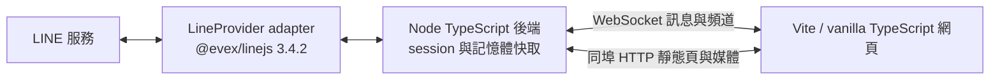

# LINE.js

本機 TypeScript LINE 網頁客戶端，以釘選的 [@evex/linejs v3.4.2](https://github.com/evex-dev/linejs/tree/v3.4.2) 連線 LINE。目標以 WebSocket 同步頻道與訊息、同埠 HTTP 提供網頁及圖片／貼圖；目前交付 Phase 1 登入驗證程序。

> 開發狀態：Gate 0 已通過；Phase 1 QR 登入、session 復用與瀏覽器登入頁已實作。實際 LINE QR 已產生並在瀏覽器渲染；**Gate 1 尚待次要帳號掃碼與真實訊息驗收**，因此尚未進入頻道、WS、歷史、發送與媒體階段。

## 定案用途與範圍

完整目標包含 QR 掃碼登入、session 復用、好友／群組／聊天室／社群清單、即時訊息及編輯事件、歷史分頁、文字／圖片／貼圖發送與顯示。影片、語音、檔案僅顯示佔位。不提供公開部署、多帳號、通話或套件發布；尚未交付的功能以 Gate 狀態為準。

本作品使用非官方 LINE API，可能造成帳號限制或封鎖。**請先用次要帳號驗證**，不要直接以主帳號測試。

## 目標系統架構（包含後續 Gate）



後端僅綁定 `127.0.0.1`，預設埠 `3789`。後端 `tsc` 建置至 `dist/`；前端 Vite 建置至 `dist/web/`。目前提供登入頁與 LINE 訊息接收計數；每頻道最多 500 則的訊息快取與媒體 LRU 將在後續 Gate 實作，不使用資料庫。

## 環境需求

- Node.js **≥ 22** 與 npm。
- 可連線至 JSR、npm 與 LINE 的網路。
- 能掃描 QR 並確認 PIN 的 LINE 次要帳號。
- `@evex/linejs` 與 `@evex/linejs-types` 均固定 **3.4.2**（JSR）；其餘直接依賴也須釘選版本。

上游 3.4.2 的 Thrift 依賴包含 high 漏洞，本專案以 `overrides` 釘選修補版 `thrift@0.23.0`，不更動 LINE 套件版本。修補依據：[CVE-2026-41636](https://github.com/advisories/GHSA-r67j-r569-jrwp)。已驗證真實 QR 產生相容性；登入完成與後續訊息仍待次要帳號驗收。

## 安裝與啟動

```sh
git clone https://github.com/JS-PACKAGE/LINE.js.git
cd LINE.js
npm install
npm run build
npm start
```

開啟 `http://127.0.0.1:3789`，點「產生登入 QR code」，用次要帳號掃描並確認畫面 PIN。QR URL 與 PIN 只交給發起登入的分頁一次，不入日誌或檔案。重啟優先復用 `session.json`，失效則等待使用者開始 QR 登入；失敗不自動循環。刷新或關閉登入分頁不重播 QR，請在原分頁完成登入，或等失效後按按鈕重試。

`session.json` 包含憑證與 E2EE key material，必須以權限 `600` 保存，不得分享或提交。`config.yaml` 為個人設定，不入版本控制。

`src/line/session.ts` 的 SessionStorage 沿用 linejs FileStorage 契約，改以序列化、權限 `600` 的暫存檔與原子替換保存資料，避免併發寫入遺失 token／key。既有檔案會收緊權限；損壞 JSON 或 symlink 拒絕載入，不覆寫原資料。寫入失敗會使後續 `flush()` 失敗，不冒充 session 已保存。

### Gate 1 實際驗收

1. 啟動程序，在網頁以**次要 LINE 帳號**掃碼並完成 PIN 確認。
2. 掃碼後於 LINE 手機傳送一則訊息；60 秒內確認 terminal 出現 `LINE 訊息收到：id=… type=… source=…`，網頁接收計數增加。只記錄訊息識別資訊，不 dump 原始內容。
3. 停止並重新 `npm start`，確認 session 直接復用、不需再次掃碼；`session.json` 權限仍為 `600`。

未實際完成上述驗收，不標記 Gate 1 通過，也不啟動 Phase 2。

## 設定

`config.example.yaml` 已附逐項繁體中文說明。首次啟動若缺少 `config.yaml`，會以不覆寫既有檔案的方式自動建立；有個人設定時優先使用個人設定。欄位分為 `server`、`line`、`history`、`cache`、`limits`。目前先驗證全部欄位；歷史、訊息與媒體限制於後續 Gate 實作套用。

- 監聽 host：`127.0.0.1`；不得改成 `0.0.0.0` 或對外提供服務。
- port：預設 `3789`，可調整；host 與 port 從 `config.yaml` 讀取，程式不得寫死。
- LINE 裝置：預設 `ANDROIDSECONDARY`。
- 歷史筆數：預設 50，單次最多 100。
- 每頻道訊息快取：最多 500 則；媒體 LRU：預設 200MB。
- WS frame：最多 256KB；文字：最多 8000 字。
- 發送：每 WS 連線最多每秒 5 次；圖片上傳：每檔最多 10MB、每連線每分鐘最多 5 次。

## 通訊協定

Phase 1 登入 spike 以同源 HTTP `POST /auth/start` 與 `GET /auth/status` 交付一次性 QR／PIN 與狀態。需 HttpOnly／SameSite cookie 與分頁識別碼；HTTP 檢查 Host、Origin，頁面使用 CSP，敏感回應 `no-store`。此登入通道將於 Phase 2 切換成定案 WS，屆時移除 HTTP 登入路徑，不保留相容 shim。

以下 WS／媒體協定為**後續 Gate 契約，尚未提供**：`ws://127.0.0.1:3789` 使用 JSON frames。完整負載見 PLAN.md 第四節。

| 方向 | type | 用途 |
|---|---|---|
| Server → Client | `hello` | 協定版本 1 與伺服器版本 |
| Server → Client | `auth:qr` / `auth:pin` / `auth:ready` | 一次性登入畫面與帳號就緒 |
| Server → Client | `channels` | 連線與重連的頻道 snapshot |
| Server → Client | `message` / `message:edit` | 即時訊息與覆寫既有訊息 |
| Server → Client | `history` / `sent` | 對應 `requestId` 的歷史及發送結果 |
| Server → Client | `error` / `status` | generic 錯誤與監聽狀態 |
| Client → Server | `history:fetch` | `requestId`、`chatId`、`limit?`、`before?` |
| Client → Server | `message:send` | `requestId`、`chatId`，文字／`mediaId`／貼圖其一 |
| Client → Server | `channels:refresh` / `ping` | 更新頻道與連線保活 |

HTTP：`GET /` 提供網頁；`GET /media/:mediaId` 提供圖片／貼圖；`POST /media/upload` 接收 `image/*` 並回傳 `{ mediaId }`。WS 不傳媒體位元組，非 localhost Origin 拒絕升級。

## 建置與驗證

以下命令已提供；`npm test` 會先建置後執行隔離的設定、session 與登入狀態測試：

```sh
npm run typecheck
npm run build
npm test
npm audit
```

測試使用 `node --test` 與 Mock Provider；Mock 不代替真實 LINE 驗收。Gate 1 需要次要帳號掃碼後 60 秒內收到一則真實訊息，Gate 2–4 另驗證網頁同步、歷史、發送與媒體。全部 Gate 及驗收條件見 [PLAN.md](PLAN.md)。

本次已驗證：後端／前端 typecheck、build、9 項測試、`npm audit` 0 vulnerabilities、實際 HTTP 安全邊界、session 權限 `600` 與 gitignore、真實 LINE QR 產生及瀏覽器 QR canvas 顯示。尚未驗證：實際帳號登入、session 帳號復用、登入後真實訊息與 listen 恢復；須由次要帳號掃碼完成，不以測試替代。

## 開發規範與授權

工程與安全規範見 [AGENTS.md](AGENTS.md)，定案企劃全文見 [PLAN.md](PLAN.md)。依功能分批提交，不混入個人設定或憑證；不得改寫既有 `LICENSE`、`.nojekyll`。

本作品 **LINE.js** 採 **Apache-2.0**，以根目錄 [LICENSE](LICENSE) 為準。消費套件 **@evex/linejs** 與 **@evex/linejs-types** 採 **MIT**，其授權獨立於本作品，詳見 [上游授權](https://github.com/evex-dev/linejs/blob/v3.4.2/LICENSE)。本倉庫僅供 clone，不發布 npm／JSR 套件。
