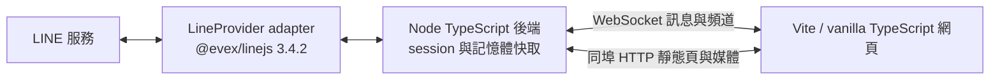

# LINE.js

本機 TypeScript LINE 網頁客戶端，以釘選的 [@evex/linejs v3.4.2](https://github.com/evex-dev/linejs/tree/v3.4.2) 連線 LINE，使用 WebSocket 同步頻道與訊息；同埠 HTTP 提供網頁及圖片／貼圖。

> 開發狀態：Phase 0 文件交付。尚未提供可執行程式；下方指令、設定與協定為 [PLAN.md](PLAN.md) 定案的實作契約，不代表已驗收。Gate 必須依序通過。

## 用途與範圍

QR 掃碼登入、session 復用、好友／群組／聊天室／社群清單、即時訊息及編輯事件、歷史分頁、文字／圖片／貼圖發送與顯示。影片、語音、檔案僅顯示佔位。不提供公開部署、多帳號、通話或套件發布。

本作品使用非官方 LINE API，可能造成帳號限制或封鎖。**請先用次要帳號驗證**，不要直接以主帳號測試。

## 系統架構



後端僅綁定 `127.0.0.1`，預設埠 `3789`。後端 `tsc` 建置至 `dist/`；前端 Vite 建置至 `dist/web/`。訊息只存記憶體，每頻道最多 500 則；媒體使用容量受限的 LRU，不使用資料庫。

## 環境需求

- Node.js **≥ 22** 與 npm。
- 可連線至 JSR、npm 與 LINE 的網路。
- 能掃描 QR 並確認 PIN 的 LINE 次要帳號。
- `@evex/linejs` 與 `@evex/linejs-types` 均固定 **3.4.2**（JSR）；其餘直接依賴也須釘選版本。

## 安裝與啟動（程式交付後使用）

```sh
git clone https://github.com/JS-PACKAGE/LINE.js.git
cd LINE.js
npm install
cp config.example.yaml config.yaml
npm run build
npm start
```

開啟 `http://127.0.0.1:3789`，用次要帳號掃描畫面 QR、確認 PIN。QR URL 與 PIN 僅在網頁一次性顯示；不得複製至日誌。重啟優先復用 `session.json`，失效才重新掃碼。登入失败後重新產生 QR 必須由使用者操作，不自動循環。

`session.json` 包含憑證與 E2EE key material，必須以權限 `600` 保存，不得分享或提交。`config.yaml` 為個人設定，不入版本控制。

## 設定契約

`config.example.yaml` 將提供可複製的預設設定；正式欄位名稱隨實作交付，避免尚未查證的設定鍵。

- 監聽 host：`127.0.0.1`；不得改成 `0.0.0.0` 或對外提供服務。
- port：預設 `3789`，可調整；host 與 port 從 `config.yaml` 讀取，程式不得寫死。
- LINE 裝置：預設 `ANDROIDSECONDARY`。
- 歷史筆數：預設 50，單次最多 100。
- 每頻道訊息快取：最多 500 則；媒體 LRU：預設 200MB。
- WS frame：最多 256KB；文字：最多 8000 字。
- 發送：每 WS 連線最多每秒 5 次；圖片上傳：每檔最多 10MB、每連線每分鐘最多 5 次。

## WebSocket 與 HTTP 協定摘要

`ws://127.0.0.1:3789` 使用 JSON frames。完整負載定義見 [PLAN.md 第四節](PLAN.md#四通訊協定ws1270013789json-frames)。

| 方向 | type | 用途 |
|---|---|---|
| Server → Client | `hello` | 協定版本 1 與伺服器版本 |
| Server → Client | `auth:qr` / `auth:pin` / `auth:ready` | 一次性登入畫面與帳號就緒 |
| Server → Client | `channels` | 連線與重連的頻道 snapshot |
| Server → Client | `message` / `message:edit` | 即時訊息與覆寫既有訊息 |
| Server → Client | `history` / `sent` | 對應 `requestId` 的歷史及發送結果 |
| Server → Client | `error` / `status` | generic 錯誤與監聽狀態 |
| Client → Server | `history:fetch` | `requestId`、`chatId`、`limit?`、`before?` |
| Client → Server | `message:send` | `requestId`、`chatId`，文字／`mediaId`／貼圖其一 |
| Client → Server | `channels:refresh` / `ping` | 更新頻道與連線保活 |

HTTP：`GET /` 提供網頁；`GET /media/:mediaId` 提供圖片／貼圖；`POST /media/upload` 接收 `image/*` 並回傳 `{ mediaId }`。WS 不傳媒體位元組，非 localhost Origin 拒絕升級。

## 建置與驗證契約

下列指令將於對應階段實作，目前不能執行：

```sh
npm run typecheck
npm run build
npm test
npm audit
```

測試使用 `node --test` 與 Mock Provider；Mock 不代替真實 LINE 驗收。Gate 1 需要次要帳號掃碼後 60 秒內收到一則真實訊息，Gate 2–4 另驗證網頁同步、歷史、發送與媒體。全部 Gate 及驗收條件見 [PLAN.md](PLAN.md)。

## 開發規範與授權

工程與安全規範見 [AGENTS.md](AGENTS.md)，定案企劃全文見 [PLAN.md](PLAN.md)。依功能分批提交，不混入個人設定或憑證；不得改寫既有 `LICENSE`、`.nojekyll`。

本作品 **LINE.js** 採 **Apache-2.0**，以根目錄 [LICENSE](LICENSE) 為準。消費套件 **@evex/linejs** 與 **@evex/linejs-types** 採 **MIT**，其授權獨立於本作品，詳見 [上游授權](https://github.com/evex-dev/linejs/blob/v3.4.2/LICENSE)。本倉庫僅供 clone，不發布 npm／JSR 套件。
